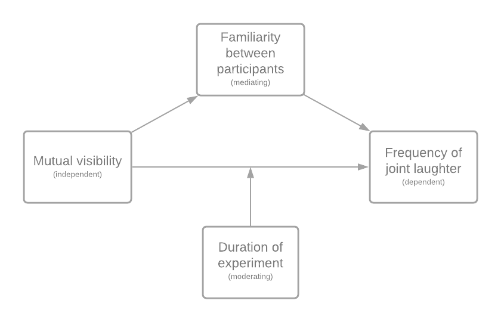
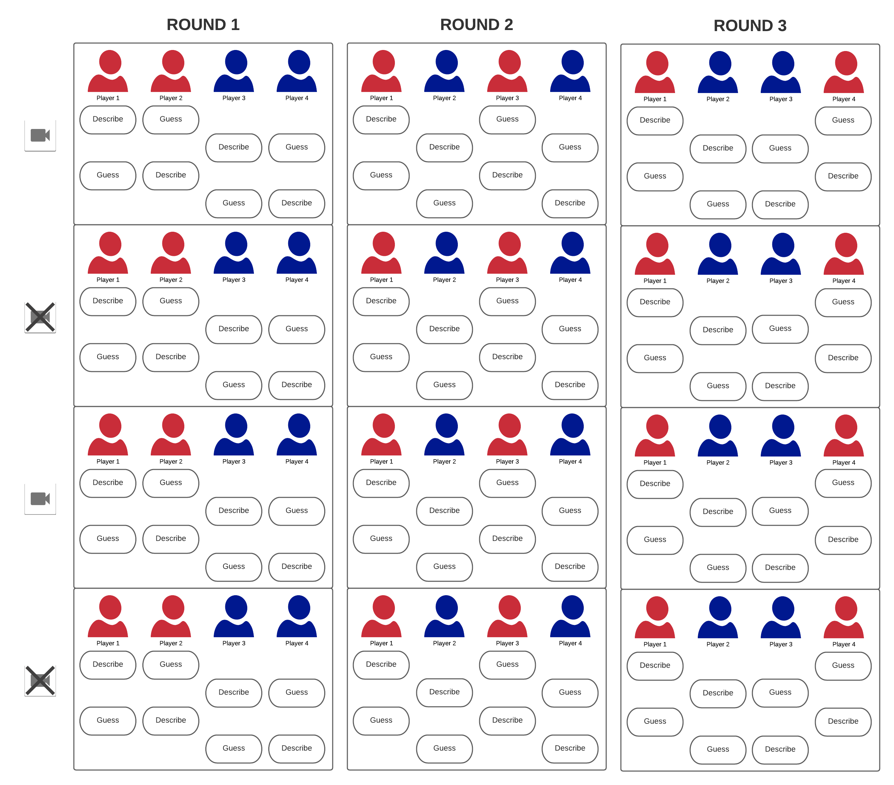

```{r setup, include=FALSE}
knitr::opts_chunk$set(echo = TRUE)
```


\tableofcontents

# Introduction
We will be using the following packages:
```{r}
library(ggplot2) # plotting
library(AICcmodavg) # aictab
library(pander) #for rendering output
library(rethinking) # for stan
```

# Part 1 - Design and set-up of true experiment 


## The motivation for the planned research
<!-- (Max 250 words) -->
The recent outbreak of the COVID-19 pandemic has changed our daily lives significantly. People are obligated to stay at home, disrupting their usual social interactions in both work and private life. The situation compels people to meet online. Typically, in such digital interactions, interlocutors can see each other by means of webcam streaming. However, this may not always be the case. Some or all interlocutors may not be visible during online dialogue, which could affect the quality of the conversation and the mutual understanding.

An important effect of the shift from face-to-face to online interaction can be revealed by studying laughter, as it is extremely contagious social behavior (Provine, 1992). Humans are very prone to unintentionally or unconsciously laugh as a social signal in any form; from a minor smile to laughing out loud. Additionally, laughing is one of the most important social signals for lubricating the flow of social interaction (Griffin et al., 2015).


## The theory underlying the research  
<!-- (Max 250 words) Preferable based on theories reported in literature -->
The effect of visibility on the use of gestures as a communicative function has been studied broadly (Alibali, Heath, & Myers, 2001; J. B. Bavelas, Chovil, Lawrie, & Wade, 1992; Cohen & Harrison, 1973; Cohen, 1977; Emmorey & Casey, 2001; Krauss, Dushay, Chen, & Rauscher, 1995; Rim´e, 1982). , J. Bavelas, Gerwing, Sutton, and Prevost (2008) provide a summary of previous experiments where rate and form of gestures were compared under two conditions: where the addressee could see the speaker and where the addressee could not see the speaker. These experiments show that speakers gestured at higher rate when they communicated with mutual visibility than without. J. Bavelas et al. (2008) extended these experiments by focusing on both visibility and dialogue as a variable, finding similar results. Furthermore, they found that speakers gestured at a significantly higher rate in a telephone dialogue than in a monologue to a tape recorder, confirming that visibility is not the only variable operating in telephone conversations. These experiments showed us that visibility plays a major role in the rate of gesturing, but that people also gesture when they are not visible to each other. As laughter can be seen as a form of gesturing, these findings are relevant for this study.

Laughing together is found to be essentially collaborative (Mehu & Dunbar, 2008; Coates, 2007). Joint laughter therefore serves important means to achieve effective team meetings (Ponton, Osbourne, Greenwood, & Thompson, 2018), considering that people who laugh on video are perceived with a higher likeability than people who do not (Reysen, 2006). This social function of joint laughter emphasises the relevance of studying the occurrence, now that the majority of meetings take place online.


## Research questions 
<!-- The research question that will be examined in the experiment (or alternatively the hypothesis that will be tested in the experiment) -->
We will aim to answer the following research question:

What is the effect of webcam visibility during online dialogue on the frequency of joint laughter?

When recognizing laughter we do not focus on the reason why someone is laughing. We
consider anything from an awkward laugh in a moment of silence to laughing out loud about
a joke as a laughter episode regardless of the context.

## The related conceptual model 
The conceptual model related to the research question can be viewed in \autoref{fig:concept_model}. The main question is about the effect of mutual visibility on joint laughter. The mediating variable is familiarity, which we can define as the level of friendliness or intimacy between people. This can be caused when people know each other (which we aim to avoid), but also when people find similarities in their interests and behaviours. It is even possible that people of the same gender will feel more familiar with each other. A moderating variable is the duration of the experiment. The participants will do the experiment for about one hour, which can have a negative effect on the frequency of laughter, thus on the frequency of joint laughter.
<!-- not sure about mediating variables -->

<!--  -->
```{r concept_model, echo=FALSE, fig.cap="\\label{fig:concept_model}The conceptual model to test the effect of mutual webcam visibility on joint laughter", out.width = '100%'}

```


## Experimental Design 
One of the most important requirements for the setup of the experiment, was the creation of a comfortable and pleasant ambiance so that people would laugh. Therefore, it was decided that a game would comply, as the participants get the chance to interact with each other in a undemanding setting where the attention of the participants would be drawn to a task. It was reasoned that this would contribute to a reduction of awkwardness and give all the participants the option to speak and laugh. Additionally, the game needed to have a smooth flow that would automatically keep going to keep the interference of the researchers to a minimum. 

The game that was chosen is called 30 Seconds. During the game, participants work together in teams (in the case of the experiment: two teams of two people) and gain points by guessing what the team member is describing. These descriptions include concepts such as famous persons, locations, movies and brands. Every team gets 30 seconds to guess as many concepts on the card as possible. Who is describing and who is guessing switches after every card.


## Experimental procedure 
The experiment will be set up in an online setting in a Zoom meeting. The host, one of us (not visible), will be able to send private messages containing the five words, share their screen and sound for a 30 second timer, and turn the participants' webcams on and off.

The following will repeat for every card of five words:

1. The host sends the words to the participant who has the turn to describe.

2. The host starts the 30 second timer.

3. The participant will try to describe as many words as possible, while his/her teammate will try to guess the words.

4. The timer rings, the host puts the score in the chat.

During the experiment, multiple things will happen. Each time all players have guessed and described a card (i.e. after four cards total), their webcams will switch on or off. After each player has guessed and described four cards (i.e. after sixteen cards total), the final score will be displayed and the teams will be rearranged. The previous will then repeat until every participant has been in a team with every other participant. An example of such an experiment is displayed in \autoref{fig:concept_setup}. To counterbalance the experiments, half of the experiments will start with the webcams on, while the other half will start with the webcams off.

```{r concept_setup, echo=FALSE, fig.cap="\\label{fig:concept_setup}An example of an experimental setup.", out.width = '100%'}

```


## Measures
The data that has been collected includes audio and video of participants. The first step in data analysis involves annotating the signals. This will be done with a program in which we can manually select timesteps in which the participant is laughing. In the end we will have annotations for every person that contains the total amount of laughter (frequency), the amount of laughter with their webcam off, and the amount of laughter with their webcam on..

In a case where different people will annotate this data, we will first let every one of them annotate the same data sample. Then we can calculate the consistency in the annotations with for example Krippendorf's Alpha or Cohen's Kappa. When this is high enough, they can start annotating separate data.

## Participants
<!-- Describe which participants will recruit in the study and how they will be recruited-->
The research is not specifically about a certain group of people, but more in general. However, we do want to aim for people with experience in an online setting and people who speak the same language. To be exact, we will conduct the experiment with people from the ages of 18 to 50 who speak dutch. The number of patricipants depends on the acceptable margin or error, which we do not know since we would have to go much more in-depth. However, since the population size basically includes more than 10.000 people and the independent variable is categorical, we should aim for around 385 participants (W.P. Brinkman, 2009). This results into around 96 experiments.

The experiments should be easy to conduct since the participants participate online; there is no need to travel. Moreover, the whole experiment should not take long. There will be 48 cards and for each card they have 30 seconds to explain. Taking some talking afterwards into account, the experiment should take 45 to 60 minutes.

To find the participants we can thus search online. Using a medium on which we state the experiment, we can find dutch people from all around the Netherlands of different age groups. They could for example sign up for a specific date, and if four people have signed up, the experiment can be held. 

## Suggested statistical analyses
<!-- Describe the statistical test you suggest to care out on the collected data-->
To determine the significance of the results we will subject the data to statistical tests. To test the effect of mutual visibility (categorical, since it is either on or off) on the frequency (numerical) we will use the Wilcoxon signed rank test. The Wilcoxon signed rank test is a suitable statistical test when the measurements for a single variable are taken under two different conditions. It is similar to the paired t-test, however the paired t-test assumes that the data is normally distributed which we cannot assume for frequency of laughter. It tests the null hypothesis that the median difference of a two sets of observations is zero.

<!-- # Part 2 - Generalized linear models -->

<!-- ## Question 1 Twitter sentiment analysis (Between groups - single factor)  -->

<!-- ### Conceptual model -->
<!-- Make a conceptual model for the following research question: Is there a difference in the sentiment of the tweets related to the different celebrities? -->

<!-- ### Collecting tweets, and data preparation -->
<!-- Include the annotated R script (excluding your personal Keys and Access Tokens information), but put echo=FALSE, so code is not included in the output pdf file. -->


<!-- ```{r, echo=FALSE, message=FALSE, warning=FALSE, include = FALSE} -->

<!-- #during writing you could add "eval = FALSE",  kntr will than not run this code chunk (take some time do) -->

<!-- #setwd("~/surfdrive/Teaching/own teaching/IN4125 - Seminar Research Methodology for Data Science/2019/coursework A")  -->
<!-- # commented this. Let's make this relative when trying to fix this file -->
<!-- # apple , note use / instead of \, which used by windows -->


<!-- #install.packages("twitteR", dependencies = TRUE) -->
<!-- library(twitteR) -->
<!-- #install.packages("RCurl", dependencies = T) -->
<!-- library(RCurl) -->
<!-- #install.packages("bitops", dependencies = T) -->
<!-- library(bitops) -->
<!-- #install.packages("plyr", dependencies = T) -->
<!-- library(plyr) -->
<!-- #install.packages('stringr', dependencies = T) -->
<!-- library(stringr) -->
<!-- #install.packages("NLP", dependencies = T) -->
<!-- library(NLP) -->
<!-- #install.packages("tm", dependencies = T) -->
<!-- library(tm) -->
<!-- #install.packages("wordcloud", dependencies=T) -->
<!-- #install.packages("RColorBrewer", dependencies=TRUE) -->
<!-- library(RColorBrewer) -->
<!-- library(wordcloud) -->
<!-- #install.packages("reshape", dependencies=T) -->
<!-- library(reshape) -->

<!-- ################### functions -->


<!-- clearTweets <- function(tweets, excl) { -->

<!--   tweets.text <- sapply(tweets, function(t)t$getText()) #get text out of tweets  -->


<!--   tweets.text = gsub('[[:cntrl:]]', '', tweets.text) -->
<!--   tweets.text = gsub('\\d+', '', tweets.text) -->
<!--   tweets.text <- str_replace_all(tweets.text,"[^[:graph:]]", " ") #remove graphic -->


<!--   corpus <- Corpus(VectorSource(tweets.text)) -->

<!--   corpus_clean <- tm_map(corpus, removePunctuation) -->
<!--   corpus_clean <- tm_map(corpus_clean, content_transformer(tolower)) -->
<!--   corpus_clean <- tm_map(corpus_clean, removeWords, stopwords("english")) -->
<!--   corpus_clean <- tm_map(corpus_clean, removeNumbers) -->
<!--   corpus_clean <- tm_map(corpus_clean, stripWhitespace) -->
<!--   corpus_clean <- tm_map(corpus_clean, removeWords, c(excl,"http","https","httpst")) -->


<!--   return(corpus_clean) -->
<!-- }  -->


<!-- ## capture all the output to a file. -->

<!-- ################# Collect from Twitter -->

<!-- # for creating a twitter app (apps.twitter.com) see youtube https://youtu.be/lT4Kosc_ers -->
<!-- #consumer_key <-'your key' -->
<!-- #consumer_scret <- 'your secret' -->
<!-- #access_token <- 'your access token' -->
<!-- #access_scret <- 'your access scret' -->

<!-- source("your_twitter.R") #this file will set my personal variables for my twitter app, adjust the name of this file. use the provide template your_twitter.R -->

<!-- setup_twitter_oauth(consumer_key,consumer_scret, access_token,access_scret) #connect to  twitter app -->


<!-- ##### This example uses the following 3 celebrities: Donald Trump, Hillary Clinton, and Bernie Sanders -->
<!-- ##  You should replace this with your own celebrities, at least 3, but more preferred  -->
<!-- ##  Note that it will take the computer some to collect the tweets -->

<!-- tweets_T <- searchTwitter("#trump", n=300, lang="en", resultType="recent") #300 recent tweets about Donald Trump, in English (I think that 1500 tweets is max) -->
<!-- tweets_C <- searchTwitter("#hillary", n=300, lang="en", resultType="recent") #300 recent tweets about Hillary Clinton -->
<!-- tweets_B <- searchTwitter("#bernie", n=300, lang="en", resultType="recent") #300 recent tweets about Bernie Sanders -->


<!-- ######################## WordCloud -->
<!-- ### This not requires in the assignment, but still fun to do  -->

<!-- # based on https://youtu.be/JoArGkOpeU0 -->

<!-- #corpus_T<-clearTweets(tweets_T, c("trump","amp","realdonaldtrump","trumptrain","donald","trumps","alwaystrump")) #remove also some campain slogans -->
<!-- #wordcloud(corpus_T, max.words=50) -->

<!-- #corpus_C<-clearTweets(tweets_C, c("hillary","amp","clinton","hillarys")) -->
<!-- #wordcloud(corpus_C,  max.words=50) -->

<!-- #corpus_B<-clearTweets(tweets_B, c("bernie", "amp", "sanders","bernies")) -->
<!-- #wordcloud(corpus_B,  max.words=50) -->
<!-- ############################## -->

<!-- ######################## Sentiment analysis -->

<!-- tweets_T.text <- laply(tweets_T, function(t)t$getText()) #get text out of tweets  -->
<!-- tweets_C.text <- laply(tweets_C, function(t)t$getText()) #get text out of tweets -->
<!-- tweets_B.text <- laply(tweets_B, function(t)t$getText()) #get text out of tweets -->


<!-- #taken from https://github.com/mjhea0/twitter-sentiment-analysis -->
<!-- pos <- scan('positive-words.txt', what = 'character', comment.char=';') #read the positive words -->
<!-- neg <- scan('negative-words.txt', what = 'character', comment.char=';') #read the negative words -->

<!-- source("sentiment3.R") #load algoritm -->
<!-- # see sentiment3.R form more information about sentiment analysis. It assigns a intereger score -->
<!-- # by substracitng the number of occurrence of negative words from that of positive words -->

<!-- analysis_T <- score.sentiment(tweets_T.text, pos, neg) -->
<!-- analysis_C <- score.sentiment(tweets_C.text, pos, neg) -->
<!-- analysis_B <- score.sentiment(tweets_B.text, pos, neg) -->


<!-- sem<-data.frame(analysis_T$score, analysis_C$score, analysis_B$score) -->


<!-- semFrame <-melt(sem, measured=c(analysis_T.score,analysis_C.score, analysis_B.score )) -->
<!-- names(semFrame) <- c("Candidate", "score") -->
<!-- semFrame$Candidate <-factor(semFrame$Candidate, labels=c("Donald Trump", "Hillary Clinton", "Bernie Sanders")) # change the labels for your celibrities -->

<!-- #The data you need for the analyses can be found in semFrame -->

<!-- ``` -->

<!-- ### Homogeneity of variance analysis -->
<!-- Analyze the homogeneity of variance of sentiments of the tweets of the different celebrities, and provide interpretation -->

<!-- ```{r} -->
<!-- #include your code and output in the document -->
<!-- ``` -->


<!-- ### Visual inspection Mean and distribution sentiments -->
<!-- Graphically examine the mean and distribution sentiments of tweets for each celebrity, and provide interpretation -->

<!-- ```{r} -->
<!-- #include your code and output in the document -->
<!-- ``` -->
<!-- ### Frequentist approach -->

<!-- #### Linear model -->
<!-- Use a linear model to analyze whether the knowledge to which celebrity a tweet relates has a significant impact on explaining the sentiments of the tweets. Provide interpretation of results  -->

<!-- ```{r} -->
<!-- #include your code and output in the document -->
<!-- ``` -->

<!-- #### Post Hoc analysis -->
<!-- If a model that includes the celebrity is better in explaining the sentiments of tweets than a model without such predictor, conduct a post-hoc analysis with e.g. Bonferroni correction, to examine which of celebrity tweets differ from the other celebrity tweets. Provide interpretation of the results -->

<!-- ```{r} -->
<!-- #include your code and output in the document -->
<!-- ``` -->

<!-- #### Report section for a scientific publication -->
<!-- Write a small section for a scientific publication, in which you report the results of the analyses, and explain the conclusions that can be drawn. -->

<!-- ### Bayesian Approach -->

<!-- #### Model description -->

<!-- Describe the mathematical model fitted on the most extensive model. (hint, look at the mark down file of the lectures to see example on formulate mathematical models in markdown). Justify the priors. -->

<!-- #### Model comparison -->

<!-- Conduct model analysis and provide brief interpretation of the results -->

<!-- ```{r} -->
<!-- #include your code and output in the document -->
<!-- ``` -->

<!-- #### Comparison celebrity pair -->

<!-- Compare sentiments of celebrity pairs and provide a brief interpretation (e.g. CIs)  -->


<!-- ## Question 2 - Website visits (between groups - Two factors) -->

<!-- ### Conceptual model -->
<!-- Make a conceptual model underlying this research question -->

<!-- ### Visual inspection -->
<!-- Graphically examine the variation in page visits for different factors levels (e.g. histogram, density plot etc.)  -->


<!-- ```{r} -->
<!-- #include your code and output in the document -->
<!-- ``` -->


<!-- ### Normality check -->
<!-- Visually inspect if variable page visits deviates from a Gaussian distribution, and discuss implication for general linear model analysis. -->


<!-- ```{r} -->
<!-- #include your code and output in the document -->
<!-- ``` -->

<!-- ### Frequentist Approach -->

<!-- #### Model analysis -->
<!-- Conduct a model analysis, to examine the added values of adding 2 factors and interaction between the factors in the model to predict page visits, and include brief interpretation of the results. -->


<!-- ```{r} -->
<!-- #include your code and output in the document -->
<!-- ``` -->


<!-- #### Simple effect analysis -->
<!-- If the analysis shows a significant two-way interaction effect, conduct a Simple Effect analysis to explore this interaction effect in more detail.It helps first to look at the means of different conditions in a figure. Provide brief interpretation of the results. -->


<!-- ```{r} -->
<!-- #include your code and output in the document -->
<!-- ``` -->


<!-- #### Report section for a scientific publication -->
<!-- Write a small section for a scientific publication, in which you report the results of the analyses, and explain the conclusions that can be drawn. -->

<!-- ### Bayesian Approach -->

<!-- #### Model description -->

<!-- Describe the mathematical model fitted on the most extensive model. (hint, look at the mark down file of the lectures to see example on formulate mathematical models in markdown). Justify the priors. -->

<!-- #### Model comparison -->

<!-- Conduct model analysis and provide brief interpretation of the results -->

<!-- ```{r} -->
<!-- #include your code and output in the document -->
<!-- ``` -->


# Part 3 - Multilevel model

## Visual inspection
<!-- Use graphics to inspect the distribution of the score, and relationship between session and score -->
The boxplot and density plot show the distribution of the score. We can see that the mean score is 122 points. The minimum is set at 59, with outliers until 46, while the maximum is set at 190, with outliers until 248.

```{r}
# Get data
filepath <- ("set0.csv")
ds <- read.csv(file=filepath, header=TRUE)
ds <- data.frame(ds)

# boxplot score overall distribution (session independent)
boxplot(ds$score)

# density score overall distribution (with mean line)
p <- ggplot(ds, aes(x=score)) + geom_density()
p + geom_vline(aes(xintercept=mean(score)), color="blue", linetype="dashed",size=1)
```

The relationship between the score and the session can be observed with the next two figures. The regression line (blue) in the scatterplot clearly shows how the score rises with the amount of sessions. This can also be observed in the box plot when looking at the mean (black line) for every box.

```{r}
# set labels
ds$sessionF <- factor(ds$session, levels=c(0:49), labels=c(0:49))

# boxplot score per session
boxplot(score~sessionF, data=ds, main="Score", xlab="session", ylab="score")

# ggplot score per session
hp <- ggplot(ds, aes(x=session, y=score)) + geom_point(shape=1) + 
  geom_smooth(formula = y ~ x,method=lm)
hp
```

## Frequentist approach

### Multilevel analysis
<!-- Conduct multilevel analysis and calculate 95% confidence intervals, determine: -->
We have conducted a multilevel analysis. We have an intercept only model (model0) which we compare to a model that includes a predictor parameter for the session (model1). By comparing these two models, we will know whether there is a difference in the score over the sessions.

```{r}
# create models as given in slides lecture 4
model0 <- lm(formula=score~1, data=ds, na.action=na.exclude)
model1 <- lm(formula=score~sessionF, data=ds, na.action=na.exclude)

# analysis, see if predictor improves fitting
pander(anova(model0,model1))
pander(anova(model1))
```

From this analysis we can see there is a significant variation between the sessions. We take a further look at the summary results.

```{r}
pander(summary(model1))
```

The summary compares the first session (intercept) with the other sessions. Looking at the estimates, we can see that compared to the first session, the scores are higher every later session. Next, we will take a look at the Akaike Information Criterion (AIC) to compare the models on the goodness-of-fit concering the out-of-sample deviance.

```{r}
#AIC
models <- list(model0, model1)
model.names <- c("model0", "model1")
pander(aictab(cand.set = models, modnames=model.names), 
       caption="Model selection based on AICc.")
```

Here we can see that model 1 has the best goodness-of-fit as it has the smallest AICc value. Lastly, we will obtain a 95% confidence interval of the estimates we have obtained earlier.

```{r}
# gives CI95%
pander(confint(model1), caption="95% confidence interval of the estimates.")
```

<!-- * If session has an impact on people score -->
<!-- * If there is significant variance between the participants in their score -->
Here we can again see an increase in score related to the sessions. From this we can conclude that the session has a positive effect on people's score. Also, it seems there is a significant variance between the participants in their score when the sessions increase.

### Report section for a scientific publication
<!-- Write a small section for a scientific publication, in which you report the results of the analyses, and explain the conclusions that can be drawn. -->

A Linear Model analysis was conducted to test the difference between sessions on the score. The results found a significant effect (F(49,16078) = 52.79, p < .001) for the sessions on the score. From the results we can conclude that over sessions the score per participant generally increases. Moreover, the variance between the participants increases when the sessions increase, which we think is caused by missing scores on later sessions or the ground truth. We cannot make any conclusions on this until the missing data is available.

## Bayesian approach

### Model description
<!-- Describe the mathematical model fitted on the most extensive model. (hint, look at the mark down file of the lectures to see example on formulate mathematical models in markdown). Justify the priors. -->

For model 2, the model with session as a factor, we take as prior a normal distribution of N(125,30). This comes from the mean of the score, 125, and a bit more than the standard deviation, which is around 27. Our sigma is set at a uniform distribution of U(0.001,30).

$$ score \sim Norm(\mu, \sigma)$$

$$ \mu = a + b * sessionF + c * subjF $$

$$ alpha = Norm(125,30) $$

$$ \sigma = Uniform(0.001, 50)$$

### Model comparison
<!-- Select the first 100 participants from the data set. (hint to overcome the Stan problem with a zero index, increase subject id number with 1). Compare models with with increasing complexity.  -->

```{r}
ds <- ds[!(ds$Subject>99),] # select first 100 subjects
ds$Subject <- ds$Subject +1 # increase subject number with 1 to overcome Stan zero index problem

mean(ds$score) # check mean
sd(ds$score) # check standard deviation

ds$sessionF <- factor(ds$session, levels=c(0:49), labels=c(0:49))
ds$subjF <- factor(ds$Subject, levels=c(1:100), labels=c(1:100))

da <- subset(ds, select=c(score, sessionF))
da1 <- subset(ds, select=c(score, sessionF, subjF))

# create model with fixed intercept (i)
m0 <- map2stan(
  alist(
    score ~ dnorm(mu, sigma),
    mu <- a,
    a ~dnorm(125,30), # mean and sd from what we found above
    sigma ~dunif(0.001,50)
  ), data = da, iter = 10000, chains = 4, cores = 4
)

# create model extended with an adaptive prior for subject id (ii)
m1 <- map2stan(
  alist(
    score ~ dnorm(mu, sigma),
    mu <- a + a_subj[subjF],
    a_subj[subjF] ~ dnorm(0,sigma_subj),
    sigma_subj ~ dcauchy(0,10),
    a ~ dnorm(125,30),
    sigma ~ dcauchy(0.001,50)
  ), data = da1, iter = 10000, chains = 4, cores = 4
)

# create model with session as a factor (iii)
m2 <- map2stan(
  alist(
    score ~ dnorm(mu, sigma),
    mu <- a[sessionF],
    a[sessionF] ~ dnorm(125,30),
    sigma ~dunif(0.001,50)
  ), data = da, iter = 10000, chains = 4, cores = 4
)

pander(compare(m0,m1,m2,func=WAIC))
```

We have created and compared the three described models. From the results we can see that model 1, the model with the adaptive prior for subject id, has the best fit since it has the smallest WAIC value and largest Akaike weight.

### Estimates examination
<!-- Examine the estimate of parameters of the model with best fit, and provide a brief interpretation. -->
From the previous comparison we could see that model 1 is the best fit model. We will further examine this model with 95% credible intervals of the parameters of this model.

```{r}
pander(precis(m1, depth=2, prob=.95))
```

We can observe that the mean between the subjects has a high variance. This means that although the scores increase per session, the subjects have very different prior skills, achieving relatively higher or lower scores in their first session than average.


