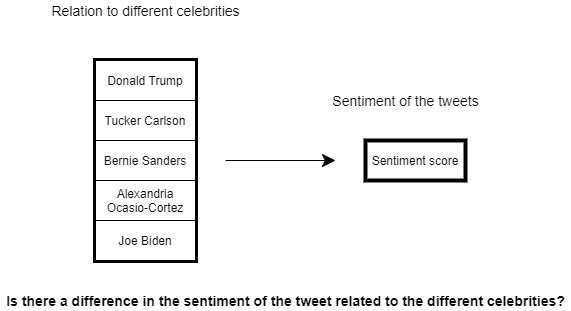

```{r setup, include=FALSE}
knitr::opts_chunk$set(echo = TRUE)
```


\tableofcontents


# Part 1 - Design and set-up of true experiment 


## The motivation for the planned research
(Max 250 words)

## The theory underlying the research  
(Max 250 words) Preferable based on theories reported in literature


## Research questions 
The research question that will be examined in the experiment (or alternatively the hypothesis that will be tested in the experiment)


## The related conceptual model 
This model should include:
*Independent variable(s)
*Dependent variable
*Mediating variable (at least 1)
*Moderating variable (at least 1)


## Experimental Design 
Note that the study should have a true experimental design

## Experimental procedure 
Describe how the experiment will be executed step by step


## Measures
Describe the measure that will be used

## Participants
Describe which participants will recruit in the study and how they will be recruited

## Suggested statistical analyses
Describe the statistical test you suggest to care out on the collected data

# Part 2 - Generalized linear models

## Question 1 Twitter sentiment analysis (Between groups - single factor)

### Conceptual model
Make a conceptual model for the following research question: Is there a difference in the sentiment of the tweets related to the different celebrities?

```{r concept_model, echo=FALSE, fig.cap="\\label{fig:concept_model}The conceptual model for the research question: Is there a difference in the sentiment of the tweets related to the different celebrities?r", out.width = '100%'}

```

### Collecting tweets, and data preparation

We found five celebrities in US politics: Donald Trump, Tucker Carlson, Bernie Sanders, Alexandria Ocasio-Cortez, Joe Biden.
As dutch students we are not well-versed in the popular English twitter celebrities, so US politics was the best option for us to find celebrities that had enough recent Tweets for the Twitter API.


```{r, echo=FALSE, message=FALSE, warning=FALSE, include = FALSE}

#during writing you could add "eval = FALSE",  kntr will than not run this code chunk (take some time do)

#setwd("~/surfdrive/Teaching/own teaching/IN4125 - Seminar Research Methodology for Data Science/2019/coursework A")
# commented this. Let's make this relative when trying to fix this file
# apple , note use / instead of \, which used by windows


#install.packages("twitteR", dependencies = TRUE)
library(twitteR)
#install.packages("RCurl", dependencies = T)
library(RCurl)
#install.packages("bitops", dependencies = T)
library(bitops)
#install.packages("plyr", dependencies = T)
library(plyr)
#install.packages('stringr', dependencies = T)
library(stringr)
#install.packages("NLP", dependencies = T)
library(NLP)
#install.packages("tm", dependencies = T)
library(tm)
#install.packages("wordcloud", dependencies=T)
#install.packages("RColorBrewer", dependencies=TRUE)
library(RColorBrewer)
library(wordcloud)
#install.packages("reshape", dependencies=T)
library(reshape)
library(car)
library(sm)
library(BayesianFirstAid)
library(rethinking)
library(ggplot2)
library(pander)
library(AICcmodavg)

################### functions

# 
# clearTweets <- function(tweets, excl) {
# 
#   tweets.text <- sapply(tweets, function(t)t$getText()) #get text out of tweets
# 
# 
#   tweets.text = gsub('[[:cntrl:]]', '', tweets.text)
#   tweets.text = gsub('\\d+', '', tweets.text)
#   tweets.text <- str_replace_all(tweets.text,"[^[:graph:]]", " ") #remove graphic
# 
# 
#   corpus <- Corpus(VectorSource(tweets.text))
# 
#   corpus_clean <- tm_map(corpus, removePunctuation)
#   corpus_clean <- tm_map(corpus_clean, content_transformer(tolower))
#   corpus_clean <- tm_map(corpus_clean, removeWords, stopwords("english"))
#   corpus_clean <- tm_map(corpus_clean, removeNumbers)
#   corpus_clean <- tm_map(corpus_clean, stripWhitespace)
#   corpus_clean <- tm_map(corpus_clean, removeWords, c(excl,"http","https","httpst"))
# 
# 
#   return(corpus_clean)
# }
# 
# 
# ## capture all the output to a file.
# 
# ################# Collect from Twitter
# 
# # for creating a twitter app (apps.twitter.com) see youtube https://youtu.be/lT4Kosc_ers
# #consumer_key <-'your key'
# #consumer_scret <- 'your secret'
# #access_token <- 'your access token'
# #access_scret <- 'your access scret'
# 
# source("your_twitter.R") #this file will set my personal variables for my twitter app, adjust the name of this file. use the provide template your_twitter.R
# 
# setup_twitter_oauth(consumer_key,consumer_scret, access_token,access_scret) #connect to  twitter app
# 
# 
# ##### This example uses the following 3 celebrities: "Donald Trump", "Tucker Carlson","Bernie Sanders", "Alexandria Ocasio-Cortez ", "Joe Biden"
# ##  You should replace this with your own celebrities, at least 3, but more preferred
# ##  Note that it will take the computer some to collect the tweets
# 
# tweets_C <- searchTwitter("#TuckerCarlson", n=294, lang="en", resultType="recent") #300 recent tweets about Donald Trump, in English (I think that 1500 tweets is max)
# tweets_T <- searchTwitter("#Trump", n=294, lang="en", resultType="recent") #300 recent tweets about Donald Trump
# tweets_A <- searchTwitter("#aoc", n=294, lang="en", resultType="recent") #300 recent tweets about Hillary Clinton
# tweets_B <- searchTwitter("#Bernie", n=294, lang="en", resultType="recent") #300 recent tweets about Bernie Sanders
# tweets_J <- searchTwitter("#biden", n=294, lang="en", resultType="recent") #300 recent tweets about Bernie Sanders
# 
# 
# 
# 
# ######################## WordCloud
# ### This not requires in the assignment, but still fun to do
# 
# # based on https://youtu.be/JoArGkOpeU0
# 
# #corpus_T<-clearTweets(tweets_T, c("trump","amp","realdonaldtrump","trumptrain","donald","trumps","alwaystrump")) #remove also some campain slogans
# #wordcloud(corpus_T, max.words=50)
# 
# #corpus_C<-clearTweets(tweets_C, c("hillary","amp","clinton","hillarys"))
# #wordcloud(corpus_C,  max.words=50)
# 
# #corpus_B<-clearTweets(tweets_B, c("bernie", "amp", "sanders","bernies"))
# #wordcloud(corpus_B,  max.words=50)
# ##############################
# 
# ######################## Sentiment analysis
# 
# tweets_T.text <- laply(tweets_T, function(t)t$getText()) #get text out of tweets
# tweets_C.text <- laply(tweets_C, function(t)t$getText()) #get text out of tweets
# tweets_B.text <- laply(tweets_B, function(t)t$getText()) #get text out of tweets
# tweets_J.text <- laply(tweets_J, function(t)t$getText()) #get text out of tweets
# tweets_A.text <- laply(tweets_A, function(t)t$getText()) #get text out of tweets
# 
# 
# 
# #taken from https://github.com/mjhea0/twitter-sentiment-analysis
# pos <- scan('positive-words.txt', what = 'character', comment.char=';') #read the positive words
# neg <- scan('negative-words.txt', what = 'character', comment.char=';') #read the negative words
# 
# source("sentiment3.R") #load algoritm
# # see sentiment3.R form more information about sentiment analysis. It assigns a intereger score
# # by substracitng the number of occurrence of negative words from that of positive words
# 
# analysis_T <- score.sentiment(tweets_T.text, pos, neg)
# analysis_C <- score.sentiment(tweets_C.text, pos, neg)
# analysis_B <- score.sentiment(tweets_B.text, pos, neg)
# analysis_A <- score.sentiment(tweets_A.text, pos, neg)
# analysis_J <- score.sentiment(tweets_J.text, pos, neg)
# 
# 
# sem<-data.frame(analysis_T$score, analysis_C$score, analysis_B$score, analysis_J$score, analysis_A$score)
# 
# 
# semFrame <-melt(sem, measured=c(analysis_T.score,analysis_C.score, analysis_B.score ))
# names(semFrame) <- c("Celeb", "score")
# semFrame$Celeb <-factor(semFrame$Celeb, labels=c("Donald Trump", "Tucker Carlson","Bernie Sanders", "Alexandria Ocasio-Cortez ", "Joe Biden")) # change the labels for your celibrities

semFrame <- readRDS(file="semFrame.Rda")


#saveRDS(semFrame, file="semFrame.Rda")
#The data you need for the analyses can be found in semFrame

```

### Homogeneity of variance analysis
```{r}
pander(leveneTest(semFrame$score, semFrame$Celeb))
```

The Levene test reveals a p-value smaller than 0.001, indicating that there is significant difference between the group variances in sentiment score. We conclude that the variance among the five groups is not equal.

### Visual inspection Mean and distribution sentiments

We plot both a line density and a distribution histogram which includes a mean line.
```{r}
#boxplot(score ~ Celeb, data = semFrame, text.font = 4)
sm.density.compare(semFrame$score, semFrame$Celeb, xlab = "Score",
                   col=c('red', 'blue', 'green', 'hotpink', 'gold'), lty=c(1,1,1,1,1))
  title(main="Visual inspection Mean and distribution sentiments")
  legend('topright', legend = levels(semFrame$Celeb),
         col=c('red', 'blue', 'green', 'hotpink', 'gold'),
         title="Celebs", lty=1, cex=0.8, text.font = 4, bg='lightblue')

cdat <- ddply(semFrame, "Celeb", summarise, score.mean=mean(score))
ggplot(semFrame, aes(x=score, fill=Celeb)) +
  geom_histogram(binwidth=1, position="dodge") +
  geom_vline(data=cdat, aes(xintercept=score.mean,  colour=Celeb),
               linetype="solid", size=0.5) 

```

We see all US politic Celebs have a mean around 0. #trump has the highest sentiment mean and the largest difference with the rest.

### Frequentist approach

#### Linear model

A one-way between subjects ANOVA was conducted to compare the effect of relation to celebrities on sentiment score in five conditions.

```{r}
model0 <- lm(formula = score ~ 1 , data = semFrame)
model1 <- lm(formula = score ~ Celeb , data = semFrame)
pander(anova(model0, model1, test = "F"))
```

There was a significant effect of relation to celebrities on sentiment score at the p<.001 level for the five conditions [F(4, 1465) = 56.06, p < 0.001]. 

```{r, echo=FALSE, message=FALSE, warning=FALSE, include = FALSE}
#(summary(model1))

#The p-value of the Celeb variable is low (p < 0.001), so it appears that the relation to celebrities has a real impact on the sentiment score.
```


```{r, echo=FALSE, message=FALSE, warning=FALSE, include = FALSE}
# smodel0 <-summary(model0)
# llm0 <-sum(dnorm(semFrame$score, mean = predict(model0), sd= smodel0$sigma, log=TRUE))
# AIC_model0 <- -2*llm0 + 2*2
# AIC_model0
# smodel1 <-summary(model1)
# llm1 <-sum(dnorm(semFrame$score, mean = predict(model1), sd= smodel1$sigma, log=TRUE))
# AIC_model1 <- -2*llm1 + 2*3
# AIC_model1
```
```{r}
#AIC
models <- list(model0, model1)
model.names <- c("model0", "model1")
pander(aictab(cand.set = models, modnames=model.names), 
       caption="Model selection based on AICc.")
```

A lower AIC indicates a better fit, which is the model with the predictor.

#### Post Hoc analysis

```{r}
pander(pairwise.t.test(semFrame$score, semFrame$Celeb, paired = FALSE, p.adjust.method = "bonferroni"))
```

Post hoc comparisons using the Bonferroni correction indicated that the corrected p-value for the trump condition was significantly different than the other conditions (p<0.001). However, between the others condition it does not show a significantly difference.

#### Report section for a scientific publication

A one-way between subjects ANOVA was conducted to compare the effect of relation to celebrities on sentiment score in five conditions. 
There was a significant effect of relation to celebrities on sentiment score at the p<.001 level for the five conditions [F(4, 1465) = 56.06, p < 0.001]. 
However, post hoc comparisons using the Bonferroni correction indicated that only the corrected p-value for the trump condition was significantly different than the other conditions (p<0.001), between the others condition it does not show a significantly difference. 
Taken together, these results suggest that some celebrities really do have an effect on the sentiment in Tweets.

### Bayesian Approach

#### Model description
The sentiment scores seem to center around 0, and all seem to be single digits.

$$ score \sim Norm(\mu, \sigma) $$
$$ \mu = \alpha +b*Celeb $$
$$ \alpha = Norm(0, 10) $$
$$ \sigma  = Uniform(0.001, 10) $$

#### Model comparison

```{r}
m0 <-map2stan(alist(
  score ~ dnorm(mu, sigma),
  mu <-a,
  a ~ dnorm(0, 10),
  sigma ~ dunif(0.001, 10)), 
  data =  semFrame ,  iter= 10000, chains = 4,   cores = 4 )

m1 <-map2stan(alist(
  score ~ dnorm(mu, sigma),
  mu <-a[Celeb] ,
  a[Celeb] ~ dnorm(0, 10),
  sigma ~ dunif(0.001, 10)), 
  data =  semFrame ,iter= 10000, chains = 4, cores = 4 )

pander(compare(m0, m1, func=WAIC))
```

Lower WAIC indicates a better performing model, so with predictors (m1) is the winning model.


#### Comparison celebrity pair

```{r}
pander(precis(m1, depth=2, prob = .95))
```

Looking at the credibility intervals of the celebrities effects, We see the conditions where the mean of a condition does not fall within a credibility interval of an other condition. This holds for the a[1] (Trump) condition and a couple other combinations. We can again conclude that some celebrities really do have an effect on the sentiment in Tweets. 

<!-- ## Question 2 - Website visits (between groups - Two factors) -->

<!-- ### Conceptual model -->
<!-- Make a conceptual model underlying this research question -->

<!-- ### Visual inspection -->
<!-- Graphically examine the variation in page visits for different factors levels (e.g. histogram, density plot etc.)  -->


<!-- ```{r} -->
<!-- #include your code and output in the document -->
<!-- ``` -->


<!-- ### Normality check -->
<!-- Visually inspect if variable page visits deviates from a Gaussian distribution, and discuss implication for general linear model analysis. -->


<!-- ```{r} -->
<!-- #include your code and output in the document -->
<!-- ``` -->

<!-- ### Frequentist Approach -->

<!-- #### Model analysis -->
<!-- Conduct a model analysis, to examine the added values of adding 2 factors and interaction between the factors in the model to predict page visits, and include brief interpretation of the results. -->


<!-- ```{r} -->
<!-- #include your code and output in the document -->
<!-- ``` -->


<!-- #### Simple effect analysis -->
<!-- If the analysis shows a significant two-way interaction effect, conduct a Simple Effect analysis to explore this interaction effect in more detail.It helps first to look at the means of different conditions in a figure. Provide brief interpretation of the results. -->


<!-- ```{r} -->
<!-- #include your code and output in the document -->
<!-- ``` -->


<!-- #### Report section for a scientific publication -->
<!-- Write a small section for a scientific publication, in which you report the results of the analyses, and explain the conclusions that can be drawn. -->

<!-- ### Bayesian Approach -->

<!-- #### Model description -->

<!-- Describe the mathematical model fitted on the most extensive model. (hint, look at the mark down file of the lectures to see example on formulate mathematical models in markdown). Justify the priors. -->

<!-- #### Model comparison -->

<!-- Conduct model analysis and provide brief interpretation of the results -->

<!-- ```{r} -->
<!-- #include your code and output in the document -->
<!-- ``` -->


<!-- # Part 3 - Multilevel model -->

<!-- ## Visual inspection -->
<!-- Use graphics to inspect the distribution of the score, and relationship between session and score -->


<!-- ```{r} -->
<!-- #include your code and output in the document -->
<!-- ``` -->

<!-- ## Frequentist approach -->

<!-- ### Multilevel analysis -->
<!-- Conduct multilevel analysis and calculate 95% confidence intervals, determine: -->

<!-- * If session has an impact on people score -->
<!-- * If there is significant variance between the participants in their score -->


<!-- ```{r} -->
<!-- #include your code and output in the document -->
<!-- ``` -->

<!-- ### Report section for a scientific publication -->
<!-- Write a small section for a scientific publication, in which you report the results of the analyses, and explain the conclusions that can be drawn. -->

<!-- ## Bayesian approach -->

<!-- ### Model description -->

<!-- Describe the mathematical model fitted on the most extensive model. (hint, look at the mark down file of the lectures to see example on formulate mathematical models in markdown). Justify the priors. -->

<!-- ### Model comparison -->

<!-- Select the first 100 participants from the data set. (hint to overcome the Stan problem with a zero index, increase subject id number with 1). Compare models with with increasing complexity.  -->

<!-- ```{r} -->
<!-- #include your code and output in the document -->
<!-- ``` -->

<!-- ### Estimates examination -->

<!-- Examine the estimate of parameters of the model with best fitt, and provide a brief interpretation. -->


<!-- ```{r} -->
<!-- #include your code and output in the document -->
<!-- ``` -->


