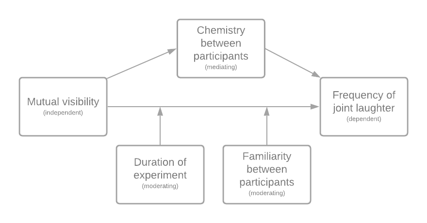

```{r setup, include=FALSE}
knitr::opts_chunk$set(echo = TRUE)
```


\tableofcontents


# Part 1 - Design and set-up of true experiment 


## The motivation for the planned research
<!-- (Max 250 words) -->
The recent outbreak of the COVID-19 pandemic has changed our daily lives significantly. People are obligated to stay at home, disrupting their usual social interactions in both work and private life. The situation compels people to meet online. Typically, in such digital interactions, interlocutors can see each other by means of webcam streaming. However, this may not always be the case. Some or all interlocutors may not be visible during online dialogue, which could affect the quality of the conversation and the mutual understanding.

An important effect of the shift from face-to-face to online interaction can be revealed by studying laughter, as it is extremely contagious social behavior (Provine, 1992). Humans are very prone to unintentionally or unconsciously laugh as a social signal in any form; from a minor smile to laughing out loud. Additionally, laughing is one of the most important social signals for lubricating the flow of social interaction (Griffin et al., 2015).


## The theory underlying the research  
<!-- (Max 250 words) Preferable based on theories reported in literature -->
The effect of visibility on the use of gestures as a communicative function has been studied broadly (Alibali, Heath, & Myers, 2001; J. B. Bavelas, Chovil, Lawrie, & Wade, 1992; Cohen & Harrison, 1973; Cohen, 1977; Emmorey & Casey, 2001; Krauss, Dushay, Chen, & Rauscher, 1995; Rim´e, 1982). , J. Bavelas, Gerwing, Sutton, and Prevost (2008) provide a summary of previous experiments where rate and form of gestures were compared under two conditions: where the addressee could see the speaker and where the addressee could not see the speaker. These experiments show that speakers gestured at higher rate when they communicated with mutual visibility than without. J. Bavelas et al. (2008) extended these experiments by focusing on both visibility and dialogue as a variable, finding similar results. Furthermore, they found that speakers gestured at a significantly higher rate in a telephone dialogue than in a monologue to a tape recorder, confirming that visibility is not the only variable operating in telephone conversations. These experiments showed us that visibility plays a major role in the rate of gesturing, but that people also gesture when they are not visible to each other. As laughter can be seen as a form of gesturing, these findings are relevant for this study.

Laughing together is found to be essentially collaborative (Mehu & Dunbar, 2008; Coates, 2007). Joint laughter therefore serves important means to achieve effective team meetings (Ponton, Osbourne, Greenwood, & Thompson, 2018), considering that people who laugh on video are perceived with a higher likeability than people who do not (Reysen, 2006). This social function of joint laughter emphasises the relevance of studying the occurrence, now that the majority of meetings take place online.


## Research questions 
<!-- The research question that will be examined in the experiment (or alternatively the hypothesis that will be tested in the experiment) -->
We will aim to answer the following research question:

What is the effect of webcam visibility during online dialogue on the frequency of joint laughter?

When recognizing laughter we do not focus on the reason why someone is laughing. We
consider anything from an awkward laugh in a moment of silence to laughing out loud about
a joke as a laughter episode regardless of the context.

## The related conceptual model 
The conceptual model related to the research question can be viewed in \autoref{fig:concept_model}. The main question is about the effect of mutual visibility on joint laughter. The mediating variable is acquaintancy, which we can define as the level of friendliness or intimacy between people who did not know each other before the experiment. This can occur when people find similarities in their interests and behaviours. Familiarity is like acquaintancy but with the factor of it being before the experiment, meaning when people know each other beforehand. Another moderating variable is the duration of the experiment. The participants will do the experiment for about one hour, which can have a negative effect on the frequency of laughter, thus on the frequency of joint laughter.


<!-- TODO: CHANGE THIS FIGURE TO MATCH CORRECT WORDS -->

<!--  -->
```{r concept_model, echo=FALSE, fig.cap="\\label{fig:concept_model}The conceptual model to test the effect of mutual webcam visibility on joint laughter", out.width = '100%'}

```


## Experimental Design 
One of the most important requirements for the setup of the experiment was the creation of a comfortable and pleasant ambiance so that people would laugh. Therefore, it was decided that a game would comply, as the participants get the chance to interact with each other in a undemanding setting where the attention of the participants would be drawn to a task. It was reasoned that this would contribute to a reduction of awkwardness and give all the participants the option to speak and laugh. Additionally, the game needed to have a smooth flow that would automatically keep going to keep the interference of the researchers to a minimum. 

The game that was chosen is called 30 Seconds. During the game, participants work together in teams (in the case of the experiment: two teams of two people) and gain points by guessing what the team member is describing. These descriptions include concepts such as famous persons, locations, movies and brands. Every team gets 30 seconds to guess as many concepts on the card as possible. Who is describing and who is guessing switches after every card.

The participants will be playing on their laptops, seeing the other three participants and a chat screen on which they will receive the words for the game. This within-subject experiment will be held where half of the experiments will start with the webcams on, while the other half will start with the webcams off. 


## Experimental procedure 
The experiment will be set up in an online setting in a Zoom meeting. The host, one of us (not visible), will be able to send private messages containing the five words, share their screen and sound for a 30 second timer, and turn the participants' webcams on and off.

The following will repeat for every card of five words:

1. The host sends the words to the participant who has the turn to describe.

2. The host starts the 30 second timer.

3. The participant will try to describe as many words as possible, while his/her teammate will try to guess the words.

4. The timer rings, the host puts the score in the chat.

During the experiment, multiple things will happen. Each time all players have guessed and described a card (i.e. after four cards total), their webcams will switch on or off. After each player has guessed and described four cards (i.e. after sixteen cards total), the final score will be displayed and the teams will be rearranged. The previous will then repeat until every participant has been in a team with every other participant. This makes sure every participant has an interaction with all the other participants, so the differences in laughter between people cannot be blamed on the interacting pairs. An example of such an experiment is displayed in \autoref{fig:concept_setup}. 

```{r concept_setup, echo=FALSE, fig.cap="\\label{fig:concept_setup}An example of an experimental setup.", out.width = '100%'}

```


## Measures
A pre-test will be held to define the level of familiarity. The participants will receive a neutral picture (e.g. from a driver's license) of the other three participants, after which they have to indicate whether they know the person. The remaining test includes a question like "Do you feel related to this person?", after which the participant can indicate why (e.g. because of their skin colour, gender, hair colour, etc.). The same questionnaire will be held after the experiment to check the level of acquaintancy.

The data that has been collected during the experiment includes audio and video of participants. The first step in data analysis involves annotating the signals. This will be done with a program in which we can manually select timesteps in which the participant is laughing. In the end we will have annotations for every person that contains the total amount of laughter (frequency), the amount of laughter with their webcam off, and the amount of laughter with their webcam on..

In a case where different people will annotate this data, we will first let every one of them annotate the same data sample. Then we can calculate the consistency in the annotations with for example Krippendorf's Alpha or Cohen's Kappa. When this is high enough, they can start annotating separate data.

## Participants
<!-- Describe which participants will recruit in the study and how they will be recruited-->
The research is not specifically about a certain group of people, but more in general. However, we do want to aim for people with experience in an online setting and people who speak the same language. To be exact, we will conduct the experiment with people from the ages of 18 to 50 who speak dutch. The number of patricipants depends on the acceptable margin or error, which we do not know since we would have to go much more in-depth. However, since the population size basically includes more than 10.000 people and the independent variable is categorical, we should aim for around 385 participants (W.P. Brinkman, 2009). This results into around 96 experiments.

The experiments should be easy to conduct since the participants participate online; there is no need to travel. Moreover, the whole experiment should not take long. There will be 48 cards and for each card they have 30 seconds to explain. Taking some talking afterwards into account, the experiment should take 45 to 60 minutes.

To find the participants we can thus search online. Using a medium on which we state the experiment, we can find dutch people from all around the Netherlands of different age groups. They could for example sign up for a specific date, and if four people have signed up, the experiment can be held. 

## Suggested statistical analyses
<!-- Describe the statistical test you suggest to care out on the collected data-->
To determine the significance of the results we will subject the data to statistical tests. To test the effect of mutual visibility (categorical, since it is either on or off) on the frequency (numerical) we will use the Wilcoxon signed rank test. The Wilcoxon signed rank test is a suitable statistical test when the measurements for a single variable are taken under two different conditions. It is similar to the paired t-test, however the paired t-test assumes that the data is normally distributed which we cannot assume for frequency of laughter. It tests the null hypothesis that the median difference of a two sets of observations is zero. The frequentist's approach is chosen since the experiment is repeated with the fixed parameters. Moreover, with this approach we can better control the Type I error. <!-- TODO: more explanation? -->

<!-- # Part 2 - Generalized linear models -->

<!-- ## Question 1 Twitter sentiment analysis (Between groups - single factor) -->

<!-- ### Conceptual model -->
<!-- Make a conceptual model for the following research question: Is there a difference in the sentiment of the tweets related to the different celebrities? -->

<!-- ```{r concept_model_twitter, echo=FALSE, fig.cap="\\label{fig:concept_model_twitter}The conceptual model for the research question: Is there a difference in the sentiment of the tweets related to the different celebrities?r", out.width = '100%'} -->
<!--  -->
<!-- ``` -->

<!-- ### Collecting tweets, and data preparation -->

<!-- We found five celebrities in US politics: Donald Trump, Tucker Carlson, Bernie Sanders, Alexandria Ocasio-Cortez, Joe Biden. -->
<!-- As dutch students we are not well-versed in the popular English twitter celebrities, so US politics was the best option for us to find celebrities that had enough recent Tweets for the Twitter API. -->


```{r, echo=FALSE, message=FALSE, warning=FALSE, include = FALSE}

# <!-- #during writing you could add "eval = FALSE",  kntr will than not run this code chunk (take some time do) -->
# 
# <!-- #setwd("~/surfdrive/Teaching/own teaching/IN4125 - Seminar Research Methodology for Data Science/2019/coursework A") -->
# <!-- # commented this. Let's make this relative when trying to fix this file -->
# <!-- # apple , note use / instead of \, which used by windows -->


#install.packages("twitteR", dependencies = TRUE)
library(twitteR)
#install.packages("RCurl", dependencies = T)
library(RCurl)
#install.packages("bitops", dependencies = T)
library(bitops)
#install.packages("plyr", dependencies = T)
library(plyr)
#install.packages('stringr', dependencies = T)
library(stringr)
#install.packages("NLP", dependencies = T)
library(NLP)
#install.packages("tm", dependencies = T)
library(tm)
#install.packages("wordcloud", dependencies=T)
#install.packages("RColorBrewer", dependencies=TRUE)
library(RColorBrewer)
library(wordcloud)
#install.packages("reshape", dependencies=T)
library(reshape)
library(car)
library(sm)
library(BayesianFirstAid)
library(rethinking)
library(ggplot2)
library(pander)
library(AICcmodavg)
library(foreign)
library(nlme)
# <!-- ################### functions -->
# 
# <!-- #  -->
# <!-- # clearTweets <- function(tweets, excl) { -->
# <!-- #  -->
# <!-- #   tweets.text <- sapply(tweets, function(t)t$getText()) #get text out of tweets -->
# <!-- #  -->
# <!-- #  -->
# <!-- #   tweets.text = gsub('[[:cntrl:]]', '', tweets.text) -->
# <!-- #   tweets.text = gsub('\\d+', '', tweets.text) -->
# <!-- #   tweets.text <- str_replace_all(tweets.text,"[^[:graph:]]", " ") #remove graphic -->
# <!-- #  -->
# <!-- #  -->
# <!-- #   corpus <- Corpus(VectorSource(tweets.text)) -->
# <!-- #  -->
# <!-- #   corpus_clean <- tm_map(corpus, removePunctuation) -->
# <!-- #   corpus_clean <- tm_map(corpus_clean, content_transformer(tolower)) -->
# <!-- #   corpus_clean <- tm_map(corpus_clean, removeWords, stopwords("english")) -->
# <!-- #   corpus_clean <- tm_map(corpus_clean, removeNumbers) -->
# <!-- #   corpus_clean <- tm_map(corpus_clean, stripWhitespace) -->
# <!-- #   corpus_clean <- tm_map(corpus_clean, removeWords, c(excl,"http","https","httpst")) -->
# <!-- #  -->
# <!-- #  -->
# <!-- #   return(corpus_clean) -->
# <!-- # } -->
# <!-- #  -->
# <!-- #  -->
# <!-- # ## capture all the output to a file. -->
# <!-- #  -->
# <!-- # ################# Collect from Twitter -->
# <!-- #  -->
# <!-- # # for creating a twitter app (apps.twitter.com) see youtube https://youtu.be/lT4Kosc_ers -->
# <!-- # #consumer_key <-'your key' -->
# <!-- # #consumer_scret <- 'your secret' -->
# <!-- # #access_token <- 'your access token' -->
# <!-- # #access_scret <- 'your access scret' -->
# <!-- #  -->
# <!-- # source("your_twitter.R") #this file will set my personal variables for my twitter app, adjust the name of this file. use the provide template your_twitter.R -->
# <!-- #  -->
# <!-- # setup_twitter_oauth(consumer_key,consumer_scret, access_token,access_scret) #connect to  twitter app -->
# <!-- #  -->
# <!-- #  -->
# <!-- # ##### This example uses the following 3 celebrities: "Donald Trump", "Tucker Carlson","Bernie Sanders", "Alexandria Ocasio-Cortez ", "Joe Biden" -->
# <!-- # ##  You should replace this with your own celebrities, at least 3, but more preferred -->
# <!-- # ##  Note that it will take the computer some to collect the tweets -->
# <!-- #  -->
# <!-- # tweets_C <- searchTwitter("#TuckerCarlson", n=294, lang="en", resultType="recent") #300 recent tweets about Donald Trump, in English (I think that 1500 tweets is max) -->
# <!-- # tweets_T <- searchTwitter("#Trump", n=294, lang="en", resultType="recent") #300 recent tweets about Donald Trump -->
# <!-- # tweets_A <- searchTwitter("#aoc", n=294, lang="en", resultType="recent") #300 recent tweets about Hillary Clinton -->
# <!-- # tweets_B <- searchTwitter("#Bernie", n=294, lang="en", resultType="recent") #300 recent tweets about Bernie Sanders -->
# <!-- # tweets_J <- searchTwitter("#biden", n=294, lang="en", resultType="recent") #300 recent tweets about Bernie Sanders -->
# <!-- #  -->
# <!-- #  -->
# <!-- #  -->
# <!-- #  -->
# <!-- # ######################## WordCloud -->
# <!-- # ### This not requires in the assignment, but still fun to do -->
# <!-- #  -->
# <!-- # # based on https://youtu.be/JoArGkOpeU0 -->
# <!-- #  -->
# <!-- # #corpus_T<-clearTweets(tweets_T, c("trump","amp","realdonaldtrump","trumptrain","donald","trumps","alwaystrump")) #remove also some campain slogans -->
# <!-- # #wordcloud(corpus_T, max.words=50) -->
# <!-- #  -->
# <!-- # #corpus_C<-clearTweets(tweets_C, c("hillary","amp","clinton","hillarys")) -->
# <!-- # #wordcloud(corpus_C,  max.words=50) -->
# <!-- #  -->
# <!-- # #corpus_B<-clearTweets(tweets_B, c("bernie", "amp", "sanders","bernies")) -->
# <!-- # #wordcloud(corpus_B,  max.words=50) -->
# <!-- # ############################## -->
# <!-- #  -->
# <!-- # ######################## Sentiment analysis -->
# <!-- #  -->
# <!-- # tweets_T.text <- laply(tweets_T, function(t)t$getText()) #get text out of tweets -->
# <!-- # tweets_C.text <- laply(tweets_C, function(t)t$getText()) #get text out of tweets -->
# <!-- # tweets_B.text <- laply(tweets_B, function(t)t$getText()) #get text out of tweets -->
# <!-- # tweets_J.text <- laply(tweets_J, function(t)t$getText()) #get text out of tweets -->
# <!-- # tweets_A.text <- laply(tweets_A, function(t)t$getText()) #get text out of tweets -->
# <!-- #  -->
# <!-- #  -->
# <!-- #  -->
# <!-- # #taken from https://github.com/mjhea0/twitter-sentiment-analysis -->
# <!-- # pos <- scan('positive-words.txt', what = 'character', comment.char=';') #read the positive words -->
# <!-- # neg <- scan('negative-words.txt', what = 'character', comment.char=';') #read the negative words -->
# <!-- #  -->
# <!-- # source("sentiment3.R") #load algoritm -->
# <!-- # # see sentiment3.R form more information about sentiment analysis. It assigns a intereger score -->
# <!-- # # by substracitng the number of occurrence of negative words from that of positive words -->
# <!-- #  -->
# <!-- # analysis_T <- score.sentiment(tweets_T.text, pos, neg) -->
# <!-- # analysis_C <- score.sentiment(tweets_C.text, pos, neg) -->
# <!-- # analysis_B <- score.sentiment(tweets_B.text, pos, neg) -->
# <!-- # analysis_A <- score.sentiment(tweets_A.text, pos, neg) -->
# <!-- # analysis_J <- score.sentiment(tweets_J.text, pos, neg) -->
# <!-- #  -->
# <!-- #  -->
# <!-- # sem<-data.frame(analysis_T$score, analysis_C$score, analysis_B$score, analysis_J$score, analysis_A$score) -->
# <!-- #  -->
# <!-- #  -->
# <!-- # semFrame <-melt(sem, measured=c(analysis_T.score,analysis_C.score, analysis_B.score )) -->
# <!-- # names(semFrame) <- c("Celeb", "score") -->
# <!-- # semFrame$Celeb <-factor(semFrame$Celeb, labels=c("Donald Trump", "Tucker Carlson","Bernie Sanders", "Alexandria Ocasio-Cortez ", "Joe Biden")) # change the labels for your celibrities -->

semFrame <- readRDS(file="semFrame.Rda")


# <!-- #saveRDS(semFrame, file="semFrame.Rda") -->
# <!-- #The data you need for the analyses can be found in semFrame -->

```

<!-- ### Homogeneity of variance analysis -->
<!-- ```{r} -->
<!-- pander(leveneTest(semFrame$score, semFrame$Celeb)) -->
<!-- ``` -->

<!-- The Levene test reveals a p-value smaller than 0.001, indicating that there is significant difference between the group variances in sentiment score. We conclude that the variance among the five groups is not equal. -->

<!-- ### Visual inspection Mean and distribution sentiments -->

<!-- We plot both a line density and a distribution histogram which includes a mean line. -->
<!-- ```{r} -->
<!-- #boxplot(score ~ Celeb, data = semFrame, text.font = 4) -->
<!-- sm.density.compare(semFrame$score, semFrame$Celeb, xlab = "Score", -->
<!--                    col=c('red', 'blue', 'green', 'hotpink', 'gold'), lty=c(1,1,1,1,1)) -->
<!--   title(main="Visual inspection Mean and distribution sentiments") -->
<!--   legend('topright', legend = levels(semFrame$Celeb), -->
<!--          col=c('red', 'blue', 'green', 'hotpink', 'gold'), -->
<!--          title="Celebs", lty=1, cex=0.8, text.font = 4, bg='lightblue') -->

<!-- cdat <- ddply(semFrame, "Celeb", summarise, score.mean=mean(score)) -->
<!-- ggplot(semFrame, aes(x=score, fill=Celeb)) + -->
<!--   geom_histogram(binwidth=1, position="dodge") + -->
<!--   geom_vline(data=cdat, aes(xintercept=score.mean,  colour=Celeb), -->
<!--                linetype="solid", size=0.5)  -->

<!-- ``` -->

<!-- We see all US politic Celebs have a mean around 0. #trump has the highest sentiment mean and the largest difference with the rest. -->

<!-- ### Frequentist approach -->

<!-- #### Linear model -->

<!-- A one-way between subjects ANOVA was conducted to compare the effect of relation to celebrities on sentiment score in five conditions. -->

<!-- ```{r} -->
<!-- modelTwitter0 <- lm(formula = score ~ 1 , data = semFrame) -->
<!-- modelTwitter1 <- lm(formula = score ~ Celeb , data = semFrame) -->
<!-- pander(anova(modelTwitter0, modelTwitter1, test = "F")) -->
<!-- ``` -->

<!-- There was a significant effect of relation to celebrities on sentiment score at the p<.001 level for the five conditions [F(4, 1465) = 56.06, p < 0.001].  -->

<!-- ```{r, echo=FALSE, message=FALSE, warning=FALSE, include = FALSE} -->
<!-- #(summary(model1)) -->

<!-- #The p-value of the Celeb variable is low (p < 0.001), so it appears that the relation to celebrities has a real impact on the sentiment score. -->
<!-- ``` -->


<!-- ```{r, echo=FALSE, message=FALSE, warning=FALSE, include = FALSE} -->
<!-- # smodel0 <-summary(model0) -->
<!-- # llm0 <-sum(dnorm(semFrame$score, mean = predict(model0), sd= smodel0$sigma, log=TRUE)) -->
<!-- # AIC_model0 <- -2*llm0 + 2*2 -->
<!-- # AIC_model0 -->
<!-- # smodel1 <-summary(model1) -->
<!-- # llm1 <-sum(dnorm(semFrame$score, mean = predict(model1), sd= smodel1$sigma, log=TRUE)) -->
<!-- # AIC_model1 <- -2*llm1 + 2*3 -->
<!-- # AIC_model1 -->
<!-- ``` -->
<!-- ```{r} -->
<!-- #AIC -->
<!-- modelsTwitter <- list(modelTwitter0, modelTwitter1) -->
<!-- modelTwitter.names <- c("modelTwitter0", "modelTwitter1") -->
<!-- pander(aictab(cand.set = modelsTwitter, modnames=modelTwitter.names),  -->
<!--        caption="Model selection based on AICc.") -->
<!-- ``` -->

<!-- A lower AIC indicates a better fit, which is the model with the predictor. -->

<!-- #### Post Hoc analysis -->

<!-- ```{r} -->
<!-- pander(pairwise.t.test(semFrame$score, semFrame$Celeb, paired = FALSE, p.adjust.method = "bonferroni")) -->
<!-- ``` -->

<!-- Post hoc comparisons using the Bonferroni correction indicated that the corrected p-value for the trump condition was significantly different than the other conditions (p<0.001). However, between the others condition it does not show a significantly difference. -->

<!-- #### Report section for a scientific publication -->

<!-- A one-way between subjects ANOVA was conducted to compare the effect of relation to celebrities on sentiment score in five conditions.  -->
<!-- There was a significant effect of relation to celebrities on sentiment score at the p<.001 level for the five conditions [F(4, 1465) = 56.06, p < 0.001].  -->
<!-- However, post hoc comparisons using the Bonferroni correction indicated that only the corrected p-value for the trump condition was significantly different than the other conditions (p<0.001), between the others condition it does not show a significantly difference.  -->
<!-- Taken together, these results suggest that some celebrities really do have an effect on the sentiment in Tweets. -->

<!-- ### Bayesian Approach -->

<!-- #### Model description -->
<!-- The sentiment scores seem to center around 0, and all seem to be single digits. -->

<!-- $$ score \sim Norm(\mu, \sigma) $$ -->
<!-- $$ \mu = \alpha +b*Celeb $$ -->
<!-- $$ \alpha = Norm(0, 10) $$ -->
<!-- $$ \sigma  = Uniform(0.001, 10) $$ -->

<!-- #### Model comparison -->

<!-- ```{r} -->
<!-- mTwitter0 <-map2stan(alist( -->
<!--   score ~ dnorm(mu, sigma), -->
<!--   mu <-a, -->
<!--   a ~ dnorm(0, 10), -->
<!--   sigma ~ dunif(0.001, 10)),  -->
<!--   data =  semFrame ,  iter= 10000, chains = 4,   cores = 4 ) -->

<!-- mTwitter1 <-map2stan(alist( -->
<!--   score ~ dnorm(mu, sigma), -->
<!--   mu <-a[Celeb] , -->
<!--   a[Celeb] ~ dnorm(0, 10), -->
<!--   sigma ~ dunif(0.001, 10)),  -->
<!--   data =  semFrame ,iter= 10000, chains = 4, cores = 4 ) -->

<!-- pander(compare(mTwitter0, mTwitter1, func=WAIC)) -->
<!-- ``` -->

<!-- Lower WAIC indicates a better performing model, so with predictors (mTwitter1) is the winning model. -->


<!-- #### Comparison celebrity pair -->

<!-- ```{r} -->
<!-- pander(precis(mTwitter1, depth=2, prob = .95)) -->
<!-- ``` -->

<!-- Looking at the credibility intervals of the celebrities effects, We see the conditions where the mean of a condition does not fall within a credibility interval of an other condition. This holds for the a[1] (Trump) condition and a couple other combinations. We can again conclude that some celebrities really do have an effect on the sentiment in Tweets.  -->

<!-- ## Question 2 - Website visits (between groups - Two factors) -->

<!-- ### Conceptual model -->
<!-- <!-- Make a conceptual model underlying this research question --> -->

<!-- ```{r concept_diag, echo=FALSE, fig.cap="\\label{fig:concept_diag}The conceptual model underlying the research question.", out.width = '100%'} -->
<!-- knitr::include_graphics("img/concept_diag.png") -->
<!-- ``` -->

<!-- ### Visual inspection -->
<!-- <!-- Graphically examine the variation in page visits for different factors levels (e.g. histogram, density plot etc.)  --> -->


<!-- ```{r} -->
<!-- filepath <- ("webvisit0.csv") -->
<!-- data <- read.csv(file=filepath, header=TRUE) -->

<!-- # changing dtype of the factors -->
<!-- data$portal = as.factor(data$portal) -->
<!-- data$version = as.factor(data$version) -->

<!-- # Function to calculate the mean and the standard deviation for each factor group -->

<!-- data_summary <- function(data, varname, groupnames){ -->
<!--   require(plyr) -->
<!--   summary_func <- function(x, col){ -->
<!--     c(mean = mean(x[[col]], na.rm=TRUE), -->
<!--       sd = sd(x[[col]], na.rm=TRUE)) -->
<!--   } -->
<!--   data_sum<-ddply(data, groupnames, .fun=summary_func, -->
<!--                   varname) -->
<!--   data_sum <- rename(data_sum, c("mean" = varname)) -->
<!--  return(data_sum) -->
<!-- } -->

<!-- df3 <- data_summary(data, varname="pages",  -->
<!--                     groupnames=c("version", "portal")) -->

<!-- p <- ggplot(df3, aes(x=version, y=pages, fill=portal)) +  -->
<!--    geom_bar(stat="identity", position=position_dodge()) + -->
<!--   geom_errorbar(aes(ymin=pages-sd, ymax=pages+sd), width=.2, -->
<!--                  position=position_dodge(.9)) -->

<!-- p + scale_fill_brewer(palette="Paired") + theme_minimal() -->

<!-- # Creating subsets of data for each combination of factors -->
<!-- subset00 <- subset(data, version == '0' & portal == '0') -->
<!-- subset01 <- subset(data, version == '0' & portal == '1') -->
<!-- subset10 <- subset(data, version == '1' & portal == '0') -->
<!-- subset11 <- subset(data, version == '1' & portal == '1') -->

<!-- ``` -->

<!-- Notable observations from the bar-plot demonstrating the mean and standard deviation of the page visits are that the mean page visits across both the versions for the 0 - portal entries (Consumer) are almost the same but vary significantly for the 1 - portal entries (Company). -->

<!-- ### Normality check -->
<!-- <!-- Visually inspect if variable page visits deviates from a Gaussian distribution, and discuss implication for general linear model analysis. --> -->


<!-- ```{r} -->
<!-- # Generating density plots -->

<!-- d <- density(data$pages) -->
<!-- plot(d, xlab='Number of Page Visits', ylab='Prob. Density', main='Aggregated Page visits') -->
<!-- abline(v = mean(data$pages), col = "black") -->

<!-- d <- density(subset00$pages) -->
<!-- plot(d, xlab='Number of Page Visits', ylab='Prob. Density', main='Page visits on Old version for Consumers entries') -->
<!-- abline(v = mean(subset00$pages), col = "red") -->

<!-- d <- density(subset01$pages) -->
<!-- plot(d, xlab='Number of Page Visits', ylab='Prob. Density', main='Page visits on Old version for Company entries') -->
<!-- abline(v = mean(subset01$pages), col = "green") -->

<!-- d <- density(subset10$pages) -->
<!-- plot(d, xlab='Number of Page Visits', ylab='Prob. Density', main='Page visits on New version for Consumers entries') -->
<!-- abline(v = mean(subset10$pages), col = "blue") -->

<!-- d <- density(subset11$pages) -->
<!-- plot(d, xlab='Number of Page Visits', ylab='Prob. Density', main='Page visits on New version for Company entries') -->
<!-- abline(v = mean(subset11$pages), col = "orange") -->
<!-- ``` -->

<!-- The Density plots indicate that none of the Page visit densities resemble a Gaussian distribtuion, apart from the page visits for New version and Old version company entries. The rest have skewed distributions and the Page visits for Old version consumer entries resembles a mixture of densities. General Linear Model analysis assumes the fact that the target continuous variable has Gaussian-error distribution and thus uses appropriate log-likelihoods for the best MLE regression fit. Since the densities do not resemble Normal distributions, this might hamper the interpretability of the results. -->

<!-- ### Frequentist Approach -->

<!-- #### Model analysis -->
<!-- <!-- Conduct a model analysis, to examine the added values of adding 2 factors and interaction between the factors in the model to predict page visits, and include brief interpretation of the results. --> -->


<!-- ```{r} -->
<!-- # Model fitting for each factor and a combination of them -->

<!-- modelWeb0 <- lm(pages ~ 1, data=data, na.action=na.exclude) -->
<!-- modelWeb1 <- lm(pages ~ version, data=data, na.action=na.exclude) -->
<!-- modelWeb2 <- lm(pages ~ portal, data=data, na.action=na.exclude) -->
<!-- modelWeb3 <- lm(pages ~ version + portal, data=data, na.action=na.exclude) -->
<!-- modelWeb4 <- lm(pages ~ version + portal + version:portal, data=data, na.action=na.exclude) -->

<!-- # ANOVA results of the effect of adding the factors -->

<!-- pander(anova(modelWeb0, modelWeb1), caption='Version as main effect on Page visits') -->

<!-- pander(anova(modelWeb0, modelWeb2), caption='Portal as main effect on Page visits') -->

<!-- pander(anova(modelWeb3, modelWeb4), caption='Interaction effect vs 2 main effects') -->

<!-- pander(anova(modelWeb4), caption='Version, Portal and interaction effect on Page visits') -->

<!-- # AICc scores of the models -->

<!-- modelsWeb <-list(modelWeb0, modelWeb1, modelWeb2, modelWeb3, modelWeb4) -->
<!-- modelWeb.names <-c("modelWeb0","modelWeb1","modelWeb2","modelWeb3","modelWeb4") -->
<!-- pander(aictab(cand.set = modelsWeb, modnames=modelWeb.names)) -->
<!-- ``` -->

<!-- The ANOVA results for the comparison of each model type indicate that the added values by including the factors individually, together and their interaction effect is statistically significant since all their p-values are <0.001. The AICc results show that model4 has the best goodness of fit since its corrected-AIC value is the least with the best log-likelihood score too. -->

<!-- #### Simple effect analysis -->
<!-- <!-- If the analysis shows a significant two-way interaction effect, conduct a Simple Effect analysis to explore this interaction effect in more detail.It helps first to look at the means of different conditions in a figure. Provide brief interpretation of the results. --> -->


<!-- ```{r} -->
<!-- data$simple <- interaction(data$version, data$portal) -->
<!-- contrast0 <-c(1,-1,0,0) #Only the 0-portal data -->
<!-- contrast1 <-c(0,0,1,-1) #Only the 1-portal data -->

<!-- SimpleEff <- cbind(contrast0,contrast1) -->
<!-- contrasts(data$simple) <- SimpleEff -->

<!-- simpleEffectModel <-lm(pages ~ simple , data = data, na.action = na.exclude) -->
<!-- pander(summary.lm(simpleEffectModel)) -->
<!-- ``` -->

<!-- After fitting a linear model on the data, it can be observed that the company portal entries (1) have a statistically significant difference and not the consumer portal entries (0). This observation also agrees with the first plot indicating the variation in page visits for the 2 factors. The 1-portal page visits have a larger difference than the 0-portal page visits for the 0 and 1 - versions. -->

<!-- #### Report section for a scientific publication -->

<!-- <!-- Write a small section for a scientific publication, in which you report the results of the analyses, and explain the conclusions that can be drawn. --> -->

<!-- A linear model was fitted on the number of page visits by users, taking website version and web portal entires as independent variables, and including a two-way interaction between these variables. The analysis found a significant main effect (F (1, 995) = 36.2, p. < 0.01) for the version factor and (F (1, 995) = 178.8, p. < 0.01) for portal factor. The analysis also found a significant two-way interaction effect ( F (1, 76) = 46.25, p. < 0.01) between these two variables. A Simple Effect analysis further examined the two-way interaction. It revealed a significant (t = 9.222, p. < 0.01) difference for the web portal entries by companies (1), but no significant effect (t = -0.4258, p. = 0.6703) was found for the web portal entries by consumers (0). -->

<!-- ### Bayesian Approach -->


<!-- #### Model description -->

<!-- <!-- Describe the mathematical model fitted on the most extensive model. (hint, look at the mark down file of the lectures to see example on formulate mathematical models in markdown). Justify the priors. --> -->

<!-- A gaussian model is fitted to each of the models. Model m0 is the base model with only an intercept. Model mWeb1 is an extension of model mWeb0 where the version in introduced as a predictor. Model mWeb2 is again an extension of model mWeb0 with portal as a predictor. In model mWeb3, both predictors are added as main effects, and model mWeb4 extends model mWeb3 by adding a two-way interaction effect between version and portal in the model. The priors are chosen with a normal distribution of N(0,1) for each of the model types. -->

<!-- The most complete model is the one which uses both the factors (Version and Portal) to determine the mean of the Gaussian distribution to model the dependent variable of Page Visits. The prior for the first variable 'a' is chosen to be a normal distribution with the mean as the mean of the page visits from the data and the uncertainty in this estimate is reflected by the standard deviation of the mean page visits as 2. The priors for the coefficients of Version and Portal are chosen to be normal distributions of mean 0 and deviation 1 since these will be anyway adjusted by the counts of the factors. The prior for the standard deviation of the of the number of page visits is chosen to be uninformed between 0.1 and 2 visits with all values within this interval having an equal chance to be -->

<!-- $$ pages \sim Norm(\mu, \sigma)$$ -->

<!-- $$ \mu = a + b * versionN + c * portalN $$ -->

<!-- $$ alpha = Norm(0,1) $$ -->

<!-- $$ \sigma = Uniform(0.1, 2)$$ -->


<!-- #### Model comparison -->

<!-- <!-- Conduct model analysis and provide brief interpretation of the results --> -->


<!-- ```{r} -->
<!-- datasub <- subset(data, select = c(pages, version, portal)) -->
<!-- datasub$versionN <- as.numeric(datasub$version) -->
<!-- datasub$portalN <- as.numeric(datasub$portal) -->

<!-- #Fitting each variant of the model -->

<!-- mWeb0 <-map2stan(     -->
<!--     alist( -->
<!--         pages ~ dnorm(mu, sigma), -->
<!--         mu <- a , -->
<!--         a ~ dnorm(1, 2), -->
<!--         sigma ~ dunif(0.1, 2) -->
<!--     ), data = datasub, iter = 10000, chains = 4, cores = 4 -->
<!-- ) -->

<!-- mWeb1 <-map2stan(     -->
<!--     alist( -->
<!--         pages ~ dnorm(mu, sigma), -->
<!--         mu <- a + b*versionN , -->
<!--         a ~ dnorm(1, 2), -->
<!--         b ~ dnorm(0, 1), -->
<!--         sigma ~ dunif(0.1, 2) -->
<!--     ), data = datasub, iter = 10000, chains = 4, cores = 4 -->
<!-- ) -->

<!-- mWeb2 <-map2stan(     -->
<!--     alist( -->
<!--         pages ~ dnorm(mu, sigma), -->
<!--         mu <- a + b*portalN , -->
<!--         a ~ dnorm(1, 2), -->
<!--         b ~ dnorm(0, 1), -->
<!--         sigma ~ dunif(0.1, 2) -->
<!--     ), data = datasub, iter = 10000, chains = 4, cores = 4 -->
<!-- ) -->

<!-- mWeb3 <-map2stan(     -->
<!--     alist( -->
<!--         pages ~ dnorm(mu, sigma), -->
<!--         mu <- a + b*versionN + c*portalN , -->
<!--         a ~ dnorm(1, 2), -->
<!--         b ~ dnorm(0, 1), -->
<!--         c ~ dnorm(0, 1), -->
<!--         sigma ~ dunif(0.1, 2) -->
<!--     ), data = datasub, iter = 10000, chains = 4, cores = 4 -->
<!-- ) -->

<!-- mWeb4 <-map2stan(     -->
<!--     alist( -->
<!--         pages ~ dnorm(mu, sigma), -->
<!--         mu <- a + b*versionN + c*portalN + d*versionN*portalN , -->
<!--         a ~ dnorm(1, 2), -->
<!--         b ~ dnorm(0, 1), -->
<!--         c ~ dnorm(0, 1), -->
<!--         d ~ dnorm(0, 1), -->
<!--         sigma ~ dunif(0.1, 2) -->
<!--     ), data = datasub, iter = 10000, chains = 4, cores = 4 -->
<!-- ) -->

<!-- pander(compare(mWeb0,mWeb1,mWeb2,mWeb3,mWeb4)) -->
<!-- pander(precis(mWeb4, prob= .95)) -->
<!-- ``` -->

<!-- The compare() function indicates the best goodness of fit has been observed for the model m4 with the least WAIC value. For further investigation of the 95% credibility intervals, the precis() function indicates that the mean value of the coefficient of version is approximately 0, unlike for the coefficients of all the other variables (c, d for portal and two-way interaction respectively). -->

# Part 3 - Multilevel model

## Visual inspection
<!-- Use graphics to inspect the distribution of the score, and relationship between session and score -->
The boxplot and density plot show the distribution of the score. We can see that the mean score is 122 points. The minimum is set at 59, with outliers until 46, while the maximum is set at 190, with outliers until 248.

```{r}
# Get data
filepath <- ("set0.csv")
ds <- read.csv(file=filepath, header=TRUE)
ds <- data.frame(ds)

# boxplot score overall distribution (session independent)
boxplot(ds$score)

# density score overall distribution (with mean line)
p <- ggplot(ds, aes(x=score)) + geom_density()
p + geom_vline(aes(xintercept=mean(score)), color="blue", linetype="dashed",size=1)
```

The relationship between the score and the session can be observed with the next two figures. The regression line (blue) in the scatterplot clearly shows how the score rises with the amount of sessions. This can also be observed in the box plot when looking at the mean (black line) for every box. Because of this, we expect that there is a fixed effect for the score over the sessions. 

```{r}

# boxplot score per session
boxplot(score~session, data=ds, main="Score", xlab="session", ylab="score")

# ggplot score per session
hp <- ggplot(ds, aes(x=session, y=score)) + geom_point(shape=1) + 
  geom_smooth(formula = y ~ x,method=lm)
hp
```

## Frequentist approach

### Multilevel analysis
<!-- Conduct multilevel analysis and calculate 95% confidence intervals, determine: -->
We have conducted a multilevel analysis. We have a model with a fixed intercept (model0, with *~1*) and a random intercept, *1|Subject*. This model is being compared to a second model (model1), which includes the variable session, i.e. the session number belonging to the score. This model is created by replacing the fixed part of the formula from *score~1* into *score~1+session*. By comparing the fit of the two models, we can see that the model extension results in a significantly better fit, $\chi$^2^(1)=6306.00, *p*<0.001.


```{r}
model0 <- lme(score~1, random = ~1|Subject, data=ds, na.action=na.exclude, method="ML")

model1 <- lme(score~session, random = ~1|Subject, data=ds, na.action=na.exclude, method="ML")

anova(model0,model1)
```

The output of the summary of model0 shows the standard deviation between the random-effect terms, being 19.07 for the intercept per subject, and 16.8 for the residuals. The fixed intercept value is 125.5. The summary of model1 shows an estimated fixed effect for session on the score of 0.98. With a p-value of 0.000, making this fixed effect significant.

```{r}
pander(summary(model0))
pander(summary(model1))
```


The summary compares the first session (intercept) with the other sessions. Looking at the estimates, we can see that compared to the first session, the scores are higher every later session. Next, we will take a look at the Akaike Information Criterion (AIC) to compare the models on the goodness-of-fit concering the out-of-sample deviance. Here we can see that model1 has the best goodness-of-fit as it has the smallest AICc value.

```{r}
models <- list(model0, model1)
model.names <- c("model0", "model1")
pander(aictab(cand.set = models, modnames=model.names), 
       caption="Model selection based on AICc.")
```
<!-- * If session has an impact on people score -->
<!-- * If there is significant variance between the participants in their score -->

Lastly, we will obtain a 95% confidence interval, giving an insight into whether the terms are significant.

```{r}
intervals(model0,0.95)
intervals(model1,0.95)
```


### Report section for a scientific publication
<!-- Write a small section for a scientific publication, in which you report the results of the analyses, and explain the conclusions that can be drawn. -->
<!-- * If session has an impact on people score -->
<!-- * If there is significant variance between the participants in their score -->

To confirm whether the sessions had an impact on the subject's scores, a multilevel analysis was performed. This showed that there was a significant variance between the subjects and their score, SD = 19.07 (95% CI 17.90, 20.31).

The relationship between the score and the session showed significant
variance in intercepts across subjects, SD = 19.13 (95% CI 17.96, 20.37),
$\chi$^2^(1)=6306.00, *p*<0.001. The score had an estimated fixed effect of 0.981 over the sessions.

<!-- TODO: write more -->

## Bayesian approach

### Model description
<!-- Describe the mathematical model fitted on the most extensive model. (hint, look at the mark down file of the lectures to see example on formulate mathematical models in markdown). Justify the priors. -->

For model 2, the model with session as a factor, we take as prior a normal distribution of N(125,30). This comes from the mean of the score, 125, and a bit more than the standard deviation, which is around 27. Our sigma is set at a uniform distribution of U(0.001,30).

$$ score \sim Norm(\mu, \sigma)$$

$$ \mu = a + b * sessionF + c * subjF $$

$$ alpha = Norm(125,30) $$

$$ \sigma = Uniform(0.001, 50)$$

### Model comparison
<!-- Select the first 100 participants from the data set. (hint to overcome the Stan problem with a zero index, increase subject id number with 1). Compare models with with increasing complexity.  -->

```{r}
ds <- ds[!(ds$Subject>99),] # select first 100 subjects
ds$Subject <- ds$Subject +1 # increase subject number with 1 to overcome Stan zero index problem

mean(ds$score) # check mean
sd(ds$score) # check standard deviation

ds$sessionF <- factor(ds$session, levels=c(0:49), labels=c(0:49))
ds$subjF <- factor(ds$Subject, levels=c(1:100), labels=c(1:100))

da <- subset(ds, select=c(score, sessionF))
da1 <- subset(ds, select=c(score, sessionF, subjF))

# create model with fixed intercept (i)
m0 <- map2stan(
  alist(
    score ~ dnorm(mu, sigma),
    mu <- a,
    a ~dnorm(125,30), # mean and sd from what we found above
    sigma ~dunif(0.001,50)
  ), data = da, iter = 10000, chains = 4, cores = 4
)

# create model extended with an adaptive prior for subject id (ii)
m1 <- map2stan(
  alist(
    score ~ dnorm(mu, sigma),
    mu <- a + a_subj[subjF],
    a_subj[subjF] ~ dnorm(0,sigma_subj),
    sigma_subj ~ dcauchy(0,10),
    a ~ dnorm(125,30),
    sigma ~ dcauchy(0.001,50)
  ), data = da1, iter = 10000, chains = 4, cores = 4
)

# create model with session as a factor (iii)
m2 <- map2stan(
  alist(
    score ~ dnorm(mu, sigma),
    mu <- a[sessionF],
    a[sessionF] ~ dnorm(125,30),
    sigma ~dunif(0.001,50)
  ), data = da, iter = 10000, chains = 4, cores = 4
)

pander(compare(m0,m1,m2,func=WAIC))
```

We have created and compared the three described models. From the results we can see that model 1, the model with the adaptive prior for subject id, has the best fit since it has the smallest WAIC value and largest Akaike weight.

### Estimates examination
<!-- Examine the estimate of parameters of the model with best fit, and provide a brief interpretation. -->
From the previous comparison we could see that model 1 is the best fit model. We will further examine this model with 95% credible intervals of the parameters of this model.

```{r}
pander(precis(m1, depth=2, prob=.95))
```

We can observe that the mean between the subjects has a high variance. This means that although the scores increase per session, the subjects have very different prior skills, achieving relatively higher or lower scores in their first session than average.


