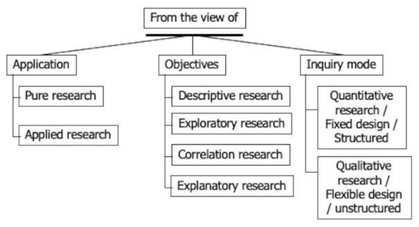
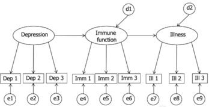

# Lecture 1: conceptualizing the research question

# Types of research

## Application

### Pure research

Fundamental, not directly linked to a particular domain, but when an answer is created it might be applied to a certain application.

### Applied research

Led by a specific problem in a domain, trying to answer it.

## Objectives

### Descriptive research

Try to portray an accurate profile of a person, event or situation.

- Requires extensive previous knowledge.
- May be flexible and or/fixed design.

### Exploratory research

Try to find out what is happening.

- Seek new insights.
- Ask questions.
- Assess phenomena in new light.
- Generate ideas and hypotheses for future research.
- Almost exclusively of flexible design.

### Correlation research

Discover or establish the existence of a relationship/association/interdependence between two or more aspects or a situation.

### Explanatory research

Seeks an explanation of the situation or problem (sometimes in the form of causal relationships).

- Explain patterns relating to the phenomenon being researched.
- Identify between aspects of the phenomenon.
- May be flexible and/or fixed design.

## Inquiry mode

How to answer the question.

### Quantitative research / Fixed design

Unit, property, timescale, and location are set before data collection begins.

- Selection of samples of individuals from known population
- Allocation of sample to different experimental conditions
- Measure on small number of variables
- Control of other variables
- May or may not involve hypothesis testing

#### Experimental strategy

Experimenter can manipulate/control the independent variable and observe the effect on the dependent variable.

#### Non-experimental strategy

Experimenter does not attempt to manipulate the independent variable.

### Qualitative research / Flexible design

Aspects may develop through the data collection process.

#### Case study

Development of detailed, intensive knowledge about a single &#39;case&#39; or of a small number of related cases.

#### Ethnographic study

Seeks to capture, interpret and explain how a group, organisation or community lives, experiences and makes sense of their lives and their world.

#### Grounded theory study

The central aim is to generate theory from data collected during the study.

## Research questions

Consist of

- **Unit**(element of the population).
- **Property** (of the element which can vary between elements of the population).

&quot;_Professional programmers&#39; attitude towards mood support software&quot;_

_Unit: Professional programmers_

_Property: attitude towards mood support software_

### Descriptive questions

Trying to describe or quantify an aspect.

&quot;_How often do programmers take a break?&quot;_

### Difference questions

Trying to compare two aspects, one impacting the other.

&quot;_Is there a difference between male and female users in time spent online?&quot;_

### Relationship questions

Trying to compare aspects on a range, what happens if one increases?

&quot;_Is there a relationship between the image quality of the focus of attention and the perceived overall quality of an image?&quot;_

## Conceptual model

### Independent variable

The cause supposed to be responsible for bringing about change in the phenomenon or situation.

### Dependent variable

The outcome of the change brought about by introduction of an independent variable.

### Interaction effect

The outcome of the change brought about by a combined effect of two or more independent variables (not simple additive). The independent variable on the outcomes depends on the state of another independent variable.

### Mediating variable

Links the independent and dependent variable. Helps to explain mechanism/process underlying the relationship between independent and dependent variable.

### Moderating variable

Might influence the strength of the relationship.

_Age on someone&#39;s anxiety._

### Extraneous variable

Might influence the dependent variable, but is not directly the focus of the study.

### Confounding variable

An extraneous variable that correlates both with independent and dependent variable.

_Murders go up when ice cream sales go up, confounding variable: weather._

## Structural equation models

### Latent factors (ellipse)

Unmeasured/unobserved variables

### Relationships (arrows)

Causal relationships

### Observed variables (squares)

Measures variables

### Error (circle e)

Measuring error

### Disturbance (circle d)

Influence not accounted for

### Endogenous variable (ellipse with incoming arrow)

Influenced by other variable in the model

### Exogenous variable (ellipse with no incoming arrow)

Variable not influenced by other variables in the model
