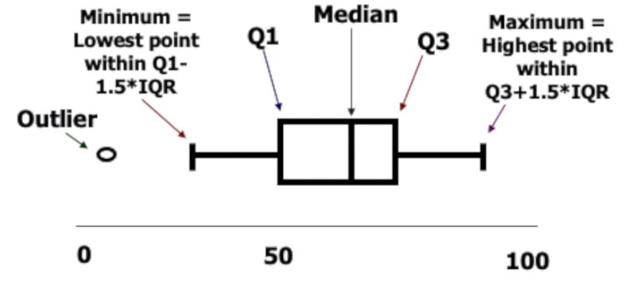
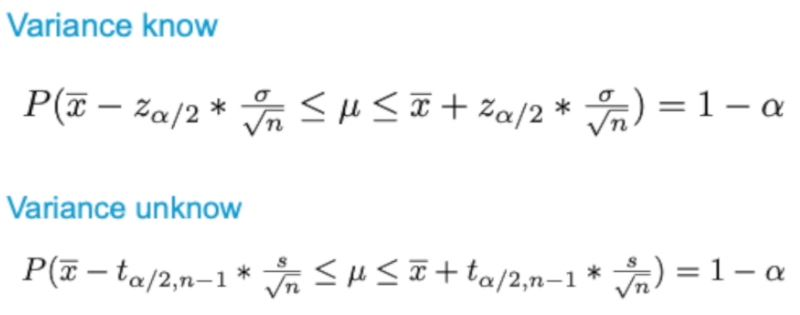
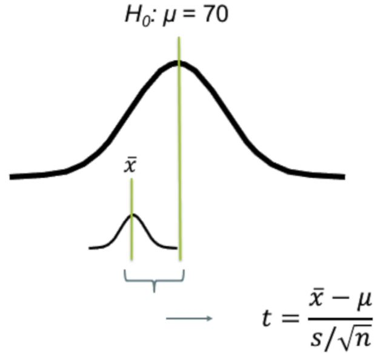
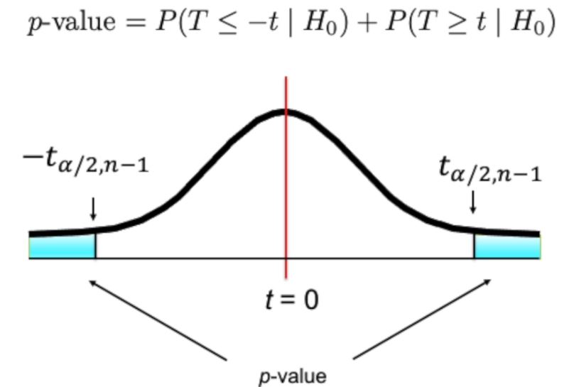

# Lecture 3: Introduction to R

[Download R](https://mirror.lyrahosting.com/CRAN/)

[Download RStudio](https://www.rstudio.com/products/rstudio/download/#download)

## Variables
- **Categorical** (qualitative)  
  - Nominal (label for category)  
    _(Nationality, gender)_
  - Ordinal (with order, no clear distance)  
    _(Grade, academic qualification, software version)_
- **Numerical** (quantitative, fixed differences)
  - Discrete (integer)  
    _(Date, degree Celsius)_
  - Continuous (real, has a sensible zero)  
    _(Age, weight, degree Kelvin)_

## Operations
- Select rows: ```which``` or ```subset```, where ```select``` can specify which columns to return  
  (```subset3 <- subset(lectureData, neurotic >15 | friends > 15, select = c(name,job))```)

- Tell R the variable is categorical: ```factor``` and ```labels```  
  (```job <- factor(job, levels = c(1:2), labels = c("Lecturer", "Student")```)

- Combine two rows: ```rbind```  
  (```d <- rbind(r1,r2)```)

- Cmbine two columns: ```cbind```  
  (```d <- cbind(d,c1)```)
  
- Import data (SPSS): ```read.spss```  
  (```Lec3 <- read.spss("dataset0_example.sav", use.value.labels=TRUE, to.data.frame=TRUE)```)

- Write to file: ```write.csv```  
  (```write.csv(Lec3, "Lec3.csv")```)

- From interval to ordinal: ```<condition> <- <category-name>```  
  (```Lec3$incomecat[Lec3$income < 15000] <- "low"```)

## Graphs
- **Box plot**  
    
  Outliers: a case whose value is very different from most others.  
  Data cleaning: remove cases (because of e.g. unreliable data, outliers)
- **Stem and leaf plot**  
  e.g 5.6 and 6.1:  
  5 | 6  
  6 | 1
- **Histogram**
  
- **Scatter plot**  
  A dot for every data point. Different types/colours of dots for different categories.

## Frequentist's confident interval
- **Frequentist approach**  
  Draws conclusions from sample data by emphasizing the frequency or proportion of the data.  
- **Confidence interval**  
  Has lower and upper bound. How often is the experiment right or wrong?  
  Amount of participants: more participants makes the confidence interval smaller.  
  Size of alhpa: larger alpha means there will be less chance that the confidence interval will include the true mean.  
  Number of experiments: more experiments means you will be closer to a normal distribution.  
  
  
## Frequentist's hypothesis testing
- 
- P-value: how often would you expect such an extreme value.  
  P < 5%, reject hypothesis (it is too rare, chance too small)  
  P > 5%, either: accept, sample size too small    
  
- Type I error: reject hypothesis while it is true.
- Type II error: accept hypothesis while it is false.

## Bayesian approach
- P(A|B) = (P(B|A) * P(A)) / P(B)

## Bayesian credibility interval

## Markov Chain Monte Carlo
