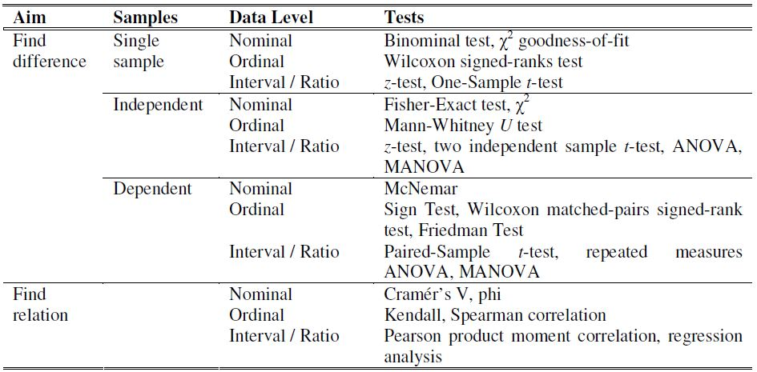

# Lecture 3: Introduction to R

[Download R](https://mirror.lyrahosting.com/CRAN/)

[Download RStudio](https://www.rstudio.com/products/rstudio/download/#download)

## Variables
- **Categorical** (qualitative)  
  - Nominal (label for category, no order)  
    _(nationality, gender)_
  - Ordinal (with order, no clear distance)  
    _(grade, academic qualification, software version)_
- **Numerical** (quantitative, fixed differences/intervals)
  - Discrete/Interval (integer)  
    _(date, degree Celsius)_
  - Continuous/Ratio (real, has a sensible zero)  
    _(age, weight, degree Kelvin)_

## Operations
- Select rows: ```which``` or ```subset```, where ```select``` can specify which columns to return  
  (```subset3 <- subset(lectureData, neurotic >15 | friends > 15, select = c(name,job))```)

- Tell R the variable is categorical: ```factor``` and ```labels```  
  (```job <- factor(job, levels = c(1:2), labels = c("Lecturer", "Student")```)

- Combine two rows: ```rbind```  
  (```d <- rbind(r1,r2)```)

- Cmbine two columns: ```cbind```  
  (```d <- cbind(d,c1)```)
  
- Import data (SPSS): ```read.spss```  
  (```Lec3 <- read.spss("dataset0_example.sav", use.value.labels=TRUE, to.data.frame=TRUE)```)

- Write to file: ```write.csv```  
  (```write.csv(Lec3, "Lec3.csv")```)

- From interval to ordinal: ```<condition> <- <category-name>```  
  (```Lec3$incomecat[Lec3$income < 15000] <- "low"```)

## Graphs
- **Box plot**  
    
  Outliers: a case whose value is very different from most others.  
  Data cleaning: remove cases (because of e.g. unreliable data, outliers)
- **Stem and leaf plot**  
  e.g 5.6 and 6.1:  
  5 | 6  
  6 | 1
- **Histogram**
  
- **Scatter plot**  
  A dot for every data point. Different types/colours of dots for different categories.

## Frequentist's confident interval
- **Frequentist approach**  
  Draws conclusions from sample data by emphasizing the frequency or proportion of the data.  
- **Confidence interval**  
  Has lower and upper bound. How often is the experiment right or wrong?  
  Amount of participants: more participants makes the confidence interval smaller.  
  Size of alhpa: larger alpha means there will be less chance that the confidence interval will include the true mean.  
  Number of experiments: more experiments means you will be closer to a normal distribution.  
  
  
## Frequentist's hypothesis testing
- 
- P-value: how often would you expect such an extreme value.  
  P < 5%, reject hypothesis (it is too rare, chance too small)  
  P > 5%, either: accept, sample size too small    
  
- Type I error: reject hypothesis while it is true.
- Type II error: accept hypothesis while it is false.

## Bayesian approach
- P(A|B) = (P(B|A) * P(A)) / P(B)

## Bayesian credibility interval

## Markov Chain Monte Carlo

## Questionnaire
1. General introduction (welcome, thanks, aim of questionnaire, where data will go to, contact info for questions)
2. Collecting biographical data (age, gender, educational background, experience in X, occupation, country of origin, etc.)
3. Introduction to topic (including defenitions, if present)
4. Questions (number them, check them carefully)
5. Rounding up (end with open question to let people comment on the questionnaire, thank them)

### Formulating questions
Clear and answerable:
- One question at a time *(e.g. "X is useful and usable")*
- Questions should be unambiguous *(e.g. "has X changed our society?")*
- The language and expected knowledge should fit the target group *(language, technical terms)*
- Formulate questions neutrally, avoid leading questions *(e.g. "do you also hate X?")*
- Avoid unnecessary sensitive questions *(e.g. asking the name of the company, not everybody wants to answer, rather ask type of company)*
- Avoid negative (or double negative) questions *(e.g. "are none of X not easy to navigate to?")*
- Split open and closed questions

### Answer scales
**Thurstone's method of equal-appearing intervals**  
For each statement indicate whether they agree or disagree

**Likert scale**  
A likelihood scale  
(e.g. extremely unlikely - quite unlikely - slight unlikely - neither - slightly likely -  quite likely - extremely likely)  
(e.g. strongly disagree - disagree - neither agree or disagree - agree - strongly agree)  

**Semantic differential scale**  
People are asked to mark a scale between bipolar words (e.g. childish - sophisticated, silly - classy, novelty - business)

### Administering
**Order of the questions**  
- questions per category (order effect: the order of questions category influences people's attitude towards the next category)
- random questions
- multiple versions of questionnaire (use the questions per category, but different order of categories)

**Number of participants**  
Depends on:
- research question
- acceptable margin of error
- level of acceptable risk that the true margin or error exceeds the accepted margin error

**Distribution**
- Direct: go door to door and ask people to fill it in (expensive)
- Telephone: first send letter, then call and take letter as reference to avoid explaining in detail (not all willing to participate cause of confusion telemarketing)
- Postal: very clear questions and instructions (low response rate)
- Email/Internet: online questionnaire (bias since not everyone might have access to this medium)

### Analysis
**Preparation**
1. Code data to numbers (e.g. male = 0, female = 1)
2. Reverse scores for some questions
3. Cronbach's alpha to check for consistency
4. Add up scores (summation, average)

**Statistical tests**  

